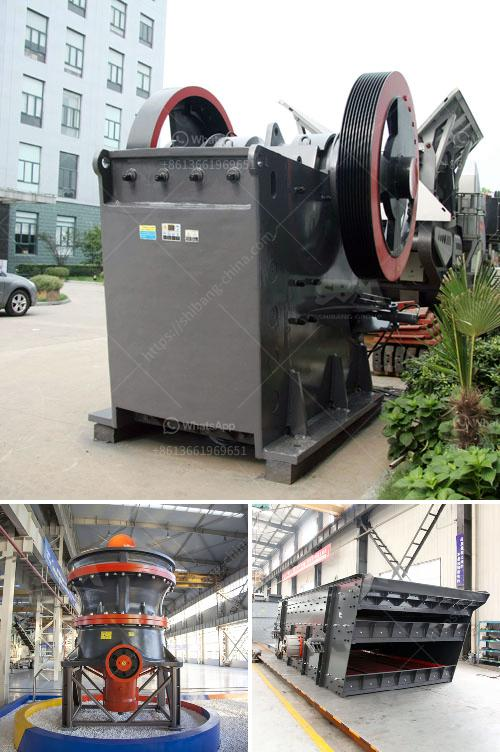

<h3>plant making bricks from marble</h3>
In recent years, sustainability has become a crucial focus for industries worldwide. One lesser-known innovation in the construction sector involves using plants to create bricks from marble waste. This eco-friendly process not only utilizes non-renewable materials efficiently but also reduces the environmental impact associated with traditional brick manufacturing. This article delves into how plants can transform discarded marble into a versatile construction material, highlighting the benefits it brings to both builders and the environment.

Marble, a luxurious and widely used material in the construction industry, often ends up as waste during the mining and processing stages. Typically, this discarded material is dumped in landfills, contributing to environmental pollution. However, with recent advancements, researchers have discovered an ingenious way of repurposing this waste through plants.

The process begins by crushing and grinding the marble waste into a fine powder. Afterward, the powder is mixed with a binding agent, usually cement or lime, to develop a homogenous mixture. This blend is then poured into molds and compressed using hydraulic presses, allowing the bricks to take shape. Once shaped, the bricks are left to dry and gain strength before they are ready to be used in construction projects.

The use of marble waste in construction through plant-based brick-making offers several advantages. Firstly, it reduces the reliance on non-renewable resources such as clay, sand, and limestone, which are traditionally used to manufacture bricks. Moreover, this technique significantly decreases environmental pollution by utilizing discarded materials.

In addition to incorporating sustainable practices, marble bricks hold several practical advantages. They possess high strength, durability, and thermal resistance, making them suitable for diverse climates. Furthermore, they exhibit low water absorption, improving insulation and reducing the need for additional waterproofing measures. The unique aesthetic and attractive appearance of marble bricks also enhance the visual appeal of buildings, making them a favored choice for architects and designers.

The innovation of plant-based brick-making using marble waste has proven to be a sustainable, cost-effective, and eco-friendly solution for the construction industry. By repurposing waste material, this process not only conserves natural resources but also reduces pollution and environmental degradation associated with traditional brick manufacturing. Moreover, the resultant marble bricks possess excellent structural properties and aesthetics, providing builders and designers with an eco-conscious alternative for constructing sustainable and visually appealing structures.
<h3>Contact us</h3><ul><li><strong>Whatsapp:&nbsp;<a href="https://wa.me/8613661969651">+8613661969651</a></strong></li><li><a href="https://swt.shibang-china.com/?git&amp;zhl&amp;plant making bricks from marble"><strong>Online Service(chat now)</strong></a></li></ul><h3>Related</h3><ul><li><a href='gold processing in philippines.md'>gold processing in philippines</a></li><li><a href='mobile concrete crusher trailer mounted.md'>mobile concrete crusher trailer mounted</a></li><li><a href='cement plant cost estimation.md'>cement plant cost estimation</a></li><li><a href='limestone processing plant in benin.md'>limestone processing plant in benin</a></li><li><a href='mobile crusher supplier.md'>mobile crusher supplier</a></li></ul>