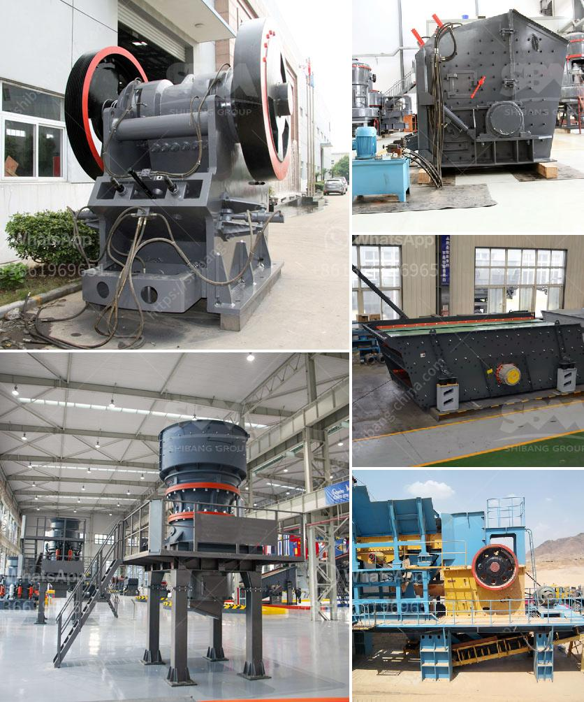

<h3>portable cone crusher plant</h3>
In today's fast-paced construction industry, flexibility is key. Given the multiple demands of the job, contractors need versatile equipment that can perform efficiently and reliably wherever the project takes them. This is where portable cone crusher plants come into play. These innovative crushers offer contractors a practical, reliable, and flexible solution to their crushing needs. 

Portable cone crusher plants are highly mobile and easily transportable, offering flexibility in a variety of situations. Their mobility is specially suited to move up and down the quarry, face or the mining pits, where they can be used to break down large material into smaller, more manageable sizes. With their compact design, operators are able to load and transport the plant from one job site to another with ease. This eliminates the need for costly transportation, as well as the logistical challenges associated with moving heavy machinery.

One of the key advantages of portable cone crusher plants is their ability to maximize productivity and reduce operating costs. By utilizing a portable crusher plant, contractors can set up their operations in a matter of hours, allowing them to quickly get to work and start generating revenue. Additionally, the crushers are designed to efficiently crush a wide range of materials, from hard rock to recycled concrete, providing contractors with the ability to tackle various projects without the need for additional equipment.

Portable cone crusher plants also offer operators the opportunity to boost their productivity through advanced technology. The machines are equipped with intelligent control systems that monitor and regulate the crushing process, ensuring optimal performance and minimal downtime. This results in increased efficiency and reduced operating costs over time. Furthermore, the cone crushers are designed to provide a high-quality end product, with precise particle size control and cubical shape, meeting the strictest specifications.

Another key advantage of portable cone crusher plants is their versatility. These machines can be used in a wide range of applications, from quarrying and mining to demolition and recycling. This makes them ideal for contractors working on various projects, as they can easily switch between different materials and crushing settings. For example, the same portable cone crusher plant can be used to crush limestone for a road construction project and then recycled concrete for a demolition job, all without the need for additional equipment.

In conclusion, portable cone crusher plants offer contractors a practical, reliable, and flexible solution to their crushing needs. Their mobility, efficiency, and versatility make them ideal for a variety of applications, from quarrying and mining to demolition and recycling. With their compact design and advanced technology, these crushers maximize productivity, reduce operating costs, and produce high-quality end products. As the construction industry continues to evolve, portable cone crusher plants will undoubtedly play a crucial role in meeting the demands of contractors worldwide.
<h3>Contact us</h3><ul><li><strong>Whatsapp:&nbsp;<a href="https://wa.me/8613661969651">+8613661969651</a></strong></li><li><a href="https://swt.shibang-china.com/?git&amp;zhl&amp;portable cone crusher plant"><strong>Online Service(chat now)</strong></a></li></ul><h3>Related</h3><ul><li><a href='silica mining technology production line.md'>silica mining technology production line</a></li><li><a href='febcoal coal mining plant in ethiopia.md'>febcoal coal mining plant in ethiopia</a></li><li><a href='cost of grinding mills for building.md'>cost of grinding mills for building</a></li><li><a href='gypsum production line in spain for sale.md'>gypsum production line in spain for sale</a></li><li><a href='price of conveyor belts for mining.md'>price of conveyor belts for mining</a></li></ul>