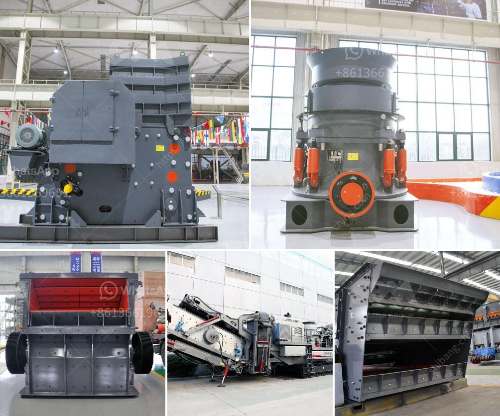

<h3>portable cone crusher</h3>
The construction industry has always been bustling with activity. From laying out the foundation to giving it the final touches, construction projects demand a lot of time, effort, and resources. Today, with the increasing need for eco-friendly and sustainable construction solutions, portable cone crushers have become a crucial part of every construction site.

With advancements in technology, cone crushers are now able to handle a wide variety of material sizes, making them popular in the construction industry where processing of raw materials is of utmost importance. Portable cone crushers, or portable cone crushing plants as they are also called, are wheel-mounted rock crushing machines. Developed especially for secondary, tertiary, and fine crushing with high productivity.

Portable cone crushers can be simply transported between production sites and used in aggregates production, recycling applications, as well as in mining operations. It is well-suited for applications such as producing manufactured sand, which is undoubtedly key to modernizing the construction industry and improving overall construction quality.

One of the key factors that boosts the efficiency of portable cone crushers is their versatility. The ability to deliver consistent and high-quality end products regardless of the material being processed is a significant advantage. With a wide range of cone crushers to choose from, EvoQuip provides the ideal solution for recycling, mining, and quarrying applications.

One of the main benefits of portable cone crushers is mobility. The work can be done at any given location and time, making it suitable for short-term construction projects. Similarly, it is also ideal for contractors who move between sites frequently, as they can easily set up and tear down the equipment as needed.

Additionally, portable cone crushers are built with heavy-duty components for optimum operation and longevity. They are equipped with efficient and powerful diesel engines that deliver reliable performance even in the harshest conditions. These machines are designed to withstand the toughest materials and weather conditions, making them highly durable and reliable.

Moreover, portable cone crushers provide unmatched flexibility in terms of the types of material that can be crushed. They can handle a wide range of applications, including crushing hard rock, making manufactured sand, and recycling waste materials. This versatility allows operators to produce multiple end products, increasing the profitability of their operations.

Another key advantage of portable cone crushers is their low operating costs. These machines are equipped with high-performance features such as large crushing force, efficient horsepower, and hydraulic control, which significantly reduce downtime, maintenance costs, and operational expenditure. This makes them a cost-effective choice for construction companies, enabling them to maximize their return on investment.

In conclusion, portable cone crushers play a crucial role in the construction industry. They provide convenience, versatility, durability, and cost-effectiveness, making them essential for any construction project. With their ability to process a wide range of materials, portable cone crushers are the perfect solution for transforming raw materials into high-quality end products. Embracing these innovative machines will undoubtedly revolutionize the construction industry, enabling operators to meet the growing demands for eco-friendly and sustainable construction solutions.
<h3>Contact us</h3><ul><li><strong>Whatsapp:&nbsp;<a href="https://wa.me/8613661969651">+8613661969651</a></strong></li><li><a href="https://swt.shibang-china.com/?git&amp;zhl&amp;portable cone crusher"><strong>Online Service(chat now)</strong></a></li></ul><h3>Related</h3><ul><li><a href='small crusher malaysia.md'>small crusher malaysia</a></li><li><a href='cost of grizzly crusher.md'>cost of grizzly crusher</a></li><li><a href='mining jaw crusher pe.md'>mining jaw crusher pe</a></li><li><a href='price of conveyor belt 6 meters.md'>price of conveyor belt 6 meters</a></li><li><a href='used clay powder drying machinery.md'>used clay powder drying machinery</a></li></ul>