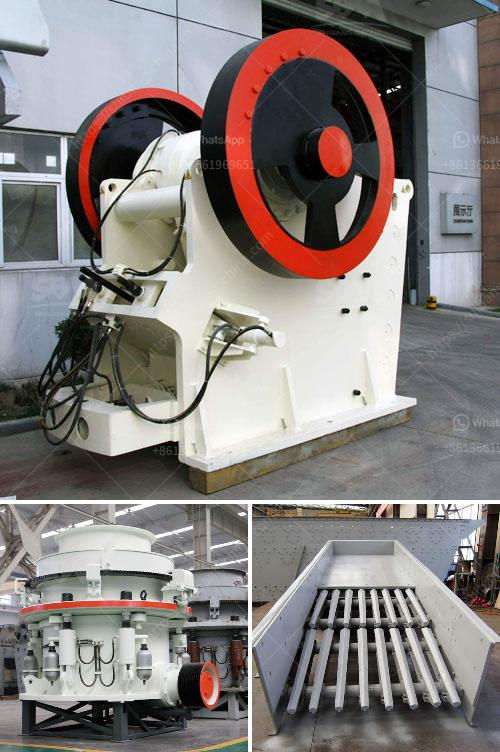

<h3>portable crushing plants for sale western cape</h3>
Portable crushing plants are a convenient and cost-effective solution for processing materials in the construction, mining, and demolition industries. These plants can be easily transported and set up on site, saving time and effort in the process. In the Western Cape region of South Africa, the demand for these plants is high due to the growing infrastructure projects and the need to generate aggregates for construction purposes.

One key advantage of portable crushing plants is their ability to crush materials at the source, which eliminates the need for hauling the materials to a stationary plant for processing. This results in substantial cost savings, especially for large-scale projects that require significant quantities of aggregates. Additionally, these plants can be relocated to new sites as needed, allowing contractors to efficiently manage their operations and maximize productivity.

Another benefit of portable crushing plants is their versatility in handling different types of materials. Whether it is concrete, asphalt, or natural stone, these plants have the capability to process various types of materials into different sizes and specifications. This flexibility makes them suitable for a wide range of applications, including road construction, building construction, and landscaping.

Furthermore, portable crushing plants are designed to be easy to operate and maintain, making them ideal for contractors of all sizes. The plants are typically equipped with user-friendly controls and safety features to ensure efficient and safe operation. In addition, many manufacturers offer comprehensive after-sales support, including training, spare parts, and technical assistance, which further enhances the usability and longevity of the plants.

In conclusion, portable crushing plants are an excellent investment for contractors in the Western Cape region of South Africa. With their ability to process materials on-site, versatility, and ease of maintenance, these plants offer numerous benefits. Whether for small-scale projects or large-scale operations, portable crushing plants can provide a cost-effective and efficient solution for crushing and screening needs.
<h3>Contact us</h3><ul><li><strong>Whatsapp:&nbsp;<a href="https://wa.me/8613661969651">+8613661969651</a></strong></li><li><a href="https://swt.shibang-china.com/?git&amp;zhl&amp;portable crushing plants for sale western cape"><strong>Online Service(chat now)</strong></a></li></ul><h3>Related</h3><ul><li><a href='ball mill manufacturer in india.md'>ball mill manufacturer in india</a></li><li><a href='mini cement plant tons per day.md'>mini cement plant tons per day</a></li><li><a href='cement process making in ashaka.md'>cement process making in ashaka</a></li><li><a href='german cement grinding unit operations.md'>german cement grinding unit operations</a></li><li><a href='ball mill zenit crusher china.md'>ball mill zenit crusher china</a></li></ul>