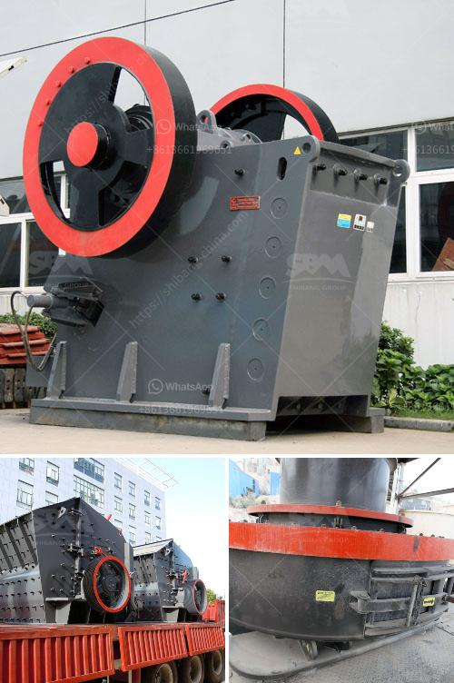

<h3>portable gold ore crusher</h3>
Gold is one of the most precious metals in the world. It is estimated that there are about 165,000 tonnes of gold above ground, and approximately another 85,000 tonnes underground. However, extracting gold from the earth can be a challenging and costly endeavor. One essential tool that enhances the gold mining process is the portable gold ore crusher.

Gold mining involves extracting gold from its ore. This can be done in various ways, but the most common method is gold panning. Gold panning involves using a shallow metal or plastic pan to scoop up gravel and sediment in a river or stream. The gold particles in the gravel tend to settle at the bottom of the pan due to their weight, while the lighter materials wash away. However, this traditional method can be time-consuming and requires a lot of manual effort.

The introduction of the portable gold ore crusher revolutionized the gold mining industry. As the name suggests, this crusher is designed to be moved easily and can be deployed in remote locations, allowing miners to extract gold from areas that were previously inaccessible. It is lightweight and compact, making it a versatile tool for both small-scale miners and larger operations.

The portable gold ore crusher is typically powered by a diesel engine or an electric motor. Its sturdy construction and high-quality materials ensure its durability, even in harsh mining environments. The crusher operates by crushing the gold-bearing rocks into smaller pieces, which are then further processed to extract the gold. The crushed material is fed into a sluice box or shaking table, where the heavy gold particles are separated from the lighter waste material.

One of the main advantages of using a portable gold ore crusher is that it can be easily transported to different sites. This allows miners to follow the gold deposits and set up their operations wherever they are most likely to find gold. Additionally, its mobility reduces the need for expensive infrastructure, such as roads or bridges, which are often lacking in remote areas.

Another benefit of using the portable gold ore crusher is its efficiency. The crusher can handle large amounts of ore at a time, significantly reducing the time and effort required to extract gold. This enables miners to increase their daily production and maximize their profits. Additionally, the crusher can be adjusted to different settings, allowing miners to customize their operations to suit the type of ore they are working with.

In conclusion, the portable gold ore crusher is an essential tool for gold mining. Its mobility, efficiency, and versatility make it a valuable asset for both small-scale miners and larger operations. As gold mining continues to be a lucrative industry, the demand for portable gold ore crushers is likely to increase. With advancements in technology, we can expect to see even more innovative crushers that further optimize the gold mining process.
<h3>Contact us</h3><ul><li><strong>Whatsapp:&nbsp;<a href="https://wa.me/8613661969651">+8613661969651</a></strong></li><li><a href="https://swt.shibang-china.com/?git&amp;zhl&amp;portable gold ore crusher"><strong>Online Service(chat now)</strong></a></li></ul><h3>Related</h3><ul><li><a href='quarry crusher for sale.md'>quarry crusher for sale</a></li><li><a href='hammer grinding machine philippines.md'>hammer grinding machine philippines</a></li><li><a href='busines project proposal for stone crusher.md'>busines project proposal for stone crusher</a></li><li><a href='list of machinery for 3000 tonnes per hour crusher.md'>list of machinery for 3000 tonnes per hour crusher</a></li><li><a href='small shore sand suction dredger machine for sale.md'>small shore sand suction dredger machine for sale</a></li></ul>