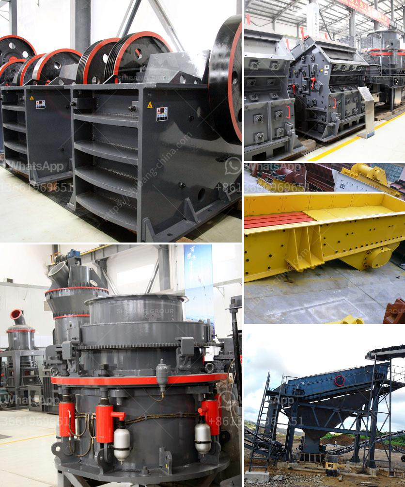

<h3>portable hand powered rock crushers zambia</h3>
Access to electricity isn't always readily available in rural communities in Zambia, leaving countless people with limited options when it comes to crushing rocks for mining and construction purposes. However, the introduction of portable hand-powered rock crushers has revolutionized the mining industry in Zambia, providing an affordable and sustainable way for individuals to process rocks and stones on-site. These innovative machines have not only saved time and labor but have also significantly improved the quality of infrastructure development in these remote areas.

Before the advent of portable hand-powered rock crushers, individuals in rural Zambia faced numerous challenges when it came to crushing rocks. Traditional methods involved the use of manual hammers and hard labor, which often resulted in inefficient and time-consuming processes. Additionally, the lack of electricity limited the possibilities of adopting modern crushing technologies, hampering the overall development of infrastructure in these regions.

However, the emergence of portable hand-powered rock crushers has changed the game. These compact and versatile machines are designed to enhance ease of use, portability, and durability. They feature a crank mechanism that allows users to crush rocks effortlessly by simply rotating the handle. This ingenious design not only eliminates the need for electricity but also makes the crushing process more efficient and less physically demanding.

The implementation of portable hand-powered rock crushers in Zambia has had several positive impacts on the mining industry and local communities. Firstly, it has provided an affordable and reliable solution for individuals who cannot afford or access conventional crushing equipment. This has enabled small-scale miners and construction workers to independently process rocks and stones, significantly reducing their reliance on expensive machinery and external contractors.

Furthermore, these crushers have improved the quality of infrastructure development in rural areas. With easier access to affordable crushing technology, individuals now have the means to produce high-quality crushed stones for road construction, building foundations, and other essential projects. This has not only enhanced local development but has also created employment opportunities for those involved in the extraction and processing of rocks.

In addition to its economic benefits, portable hand-powered rock crushers have also contributed to environmental sustainability. Previously, manual crushing techniques resulted in a considerable waste of energy and resources. The introduction of these crushers has reduced the excessive use of manual labor, minimizing the physical strain on individuals while ensuring efficient use of manpower. Additionally, the absence of diesel or electricity dependency has significantly reduced carbon emissions, contributing to a greener and cleaner environment.

To further promote the use of portable hand-powered rock crushers in Zambia, it is essential that stakeholders provide support and training to the local communities. Education programs and workshops can be organized to empower individuals by imparting knowledge on proper use, maintenance, and safety precautions of these machines. Additionally, local manufacturing and distribution networks can be established to ensure the availability and affordability of these crushers in remote areas.

Portable hand-powered rock crushers have become a game-changer in Zambia’s mining industry, empowering individuals and rural communities with a sustainable and practical solution for rock crushing. By reducing reliance on costly machinery and extending access to affordable technology, these crushers have contributed to improved infrastructure development, employment opportunities, and environmental sustainability. With the continued support and promotion of these innovative machines, Zambia's rural communities can forge a path towards self-reliance and prosperity.
<h3>Contact us</h3><ul><li><strong>Whatsapp:&nbsp;<a href="https://wa.me/8613661969651">+8613661969651</a></strong></li><li><a href="https://swt.shibang-china.com/?git&amp;zhl&amp;portable hand powered rock crushers zambia"><strong>Online Service(chat now)</strong></a></li></ul><h3>Related</h3><ul><li><a href='gypsum powder production business plan.md'>gypsum powder production business plan</a></li><li><a href='cone crusher for sale.md'>cone crusher for sale</a></li><li><a href='metal conveyor belts in plates.md'>metal conveyor belts in plates</a></li><li><a href='gypsum production line in spain for sale.md'>gypsum production line in spain for sale</a></li><li><a href='mobile concrete crusher trailer mounted.md'>mobile concrete crusher trailer mounted</a></li></ul>