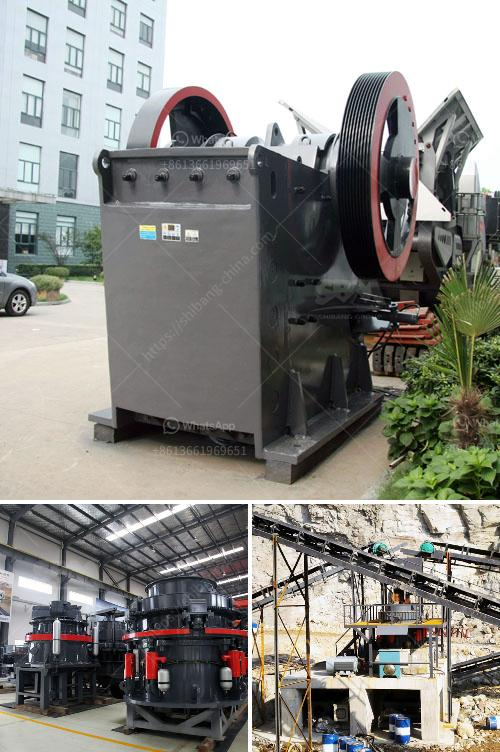

<h3>portable limestone jaw crusher for hire in south africa</h3>
Portable limestone jaw crusher is the mobile crushing solution in quarrying applications such as granite and limestone and is equally effective on concrete and asphalt in a demolition or recycling environment. In this article, we focus on equipment selection for different purposes in South Africa.

Portable limestone jaw crusher is ideally suited for crushing and screening applications, as the small jaw crusher supplier in South Africa, we offer advanced, rational solutions for any size-reduction requirements, including quarry, aggregate, grinding production and complete plant plan. If you are interested, please contact us for more information.

The limestone jaw crusher is ideal for primary and secondary crushing. With the increase of production, our jaw crusher can greatly reduce the operating costs. And it is of reliability and flexibility. The large feed opening and force-feeding action from the inward and downward eccentric movement of the swing jaw mean that jaw crusher can increase the capacity. The jaw has a smaller discharge setting, allowing for a higher degree of flexibility with relative equipment. Positive setting adjustment is convenient and ensures precise control of the crushing process.

With its compact structure, portable limestone jaw crusher can be easily moved to different crushing sites. It can work independently or with other units according to the different materials’ processing requirements. Moreover, portable limestone jaw crusher provides high efficiency and low cost project plan without environment limit for the client.

Due to its optimized unique dynamic design, portable limestone jaw crusher is easy to maintain and repair. This jaw crusher is widely used in mining, metallurgy, construction, highway, railway, water conservancy and chemical industry. And this machine can break materials into medium size and fine size.

Portable limestone jaw crusher for hire in South Africa is different from fixed limestone jaw crusher for hire in South Africa, because it adopts a compact and integrated design structure, which not only saves space, but also can simplify the operation and make the maintenance more convenient. The equipment integrates feeding, crushing, conveying and screening functions in one, which greatly reduces the floor space and equipment investment cost. At the same time, it can also play its own performance advantages, adapt to different work conditions, and provide efficient and convenient solutions for diversified material processing.

In conclusion, portable limestone jaw crusher is suitable for primary and secondary crushing applications in South Africa. The innovative design, compact structure and integrated motor installation ensure the efficiency and reliability of this equipment, and can effectively reduce maintenance and operating costs. With its excellent performance and convenient mobility, portable limestone jaw crusher is an ideal choice for customers in South Africa.
<h3>Contact us</h3><ul><li><strong>Whatsapp:&nbsp;<a href="https://wa.me/8613661969651">+8613661969651</a></strong></li><li><a href="https://swt.shibang-china.com/?git&amp;zhl&amp;portable limestone jaw crusher for hire in south africa"><strong>Online Service(chat now)</strong></a></li></ul><h3>Related</h3><ul><li><a href='sag mill grinding ball.md'>sag mill grinding ball</a></li><li><a href='stone crushing system.md'>stone crushing system</a></li><li><a href='steed conveyor belting.md'>steed conveyor belting</a></li><li><a href='quarry stone machine in uk.md'>quarry stone machine in uk</a></li><li><a href='consol glass recycling price list south africa.md'>consol glass recycling price list south africa</a></li></ul>