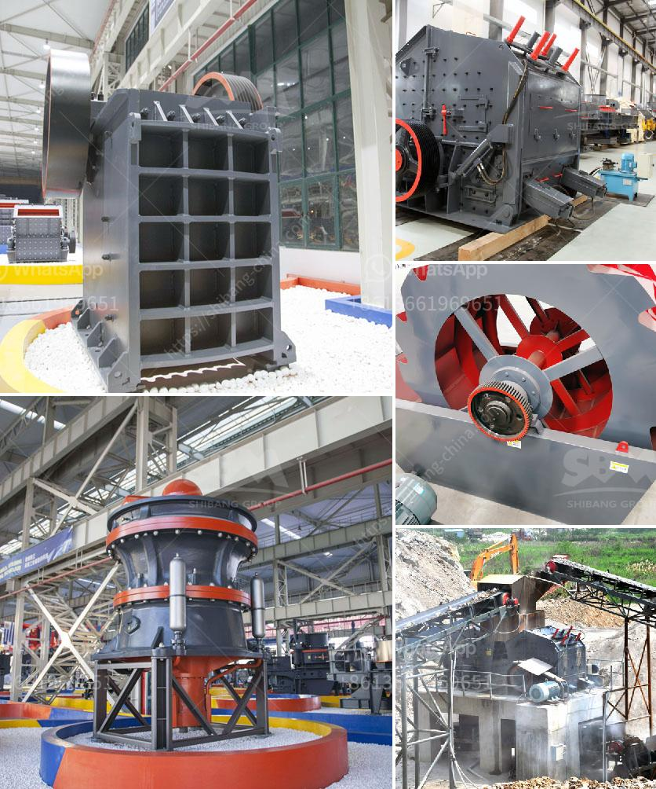

<h3>portable mobile crusher for sale</h3>
Mobile crushers are essential for the crushing of various types of rocks and ores. The introduction of mobile crushers eliminates the cumbersome steel frame structure and the foundation construction, thus saving a lot of time. With mobile crushers, users can flexibly and quickly move the operation site, which greatly reduces the transportation cost of materials.

One type of portable mobile crusher is the crawler crusher. Crawler crushers are mainly constituted by crushing equipment, feeding and conveying systems, and control systems. The rock is crushed by a jaw crusher or an impact crusher, and then conveyed onto the main conveyor belt, where the size is adjusted for further crushing. The crushed materials can be finely ground on a vibrating screen for subsequent operations or removed directly from the conveyor belt.

When it comes to the advantages of using portable mobile crushers, several come to mind. Firstly, the transportability of the machine is a key factor. Being able to move the crusher to the material rather than transporting the material to the crusher greatly reduces the cost of transportation. This is especially beneficial in application scenarios such as construction waste crushing, where the material needs to be processed at the construction site.

Secondly, the flexibility of operation enhances productivity. Portable mobile crushers can be assembled according to different crushing requirements, such as different crushing process requirements or different screening process requirements. This adaptability ensures that the machine can be used in various working conditions, even in narrow spaces or on rough terrains.

Furthermore, portable mobile crushers allow for quick adjustment and controlled discharge size. The integrated hydraulic control system can automatically adjust the crusher settings to achieve the desired product size. This provides the operator with greater control over the granularity of the final product, making it easier to meet specific customer requirements.

Additionally, portable mobile crushers offer significant environmental benefits. Traditional stationary crushers are often fixed, leading to a concentrated accumulation of materials and increased dust emissions. With portable mobile crushers, the crushing operation can be relocated closer to the material source, significantly reducing the amount of dust and noise produced during the crushing process.

In conclusion, portable mobile crushers bring a multitude of benefits to the construction and mining industries. Their flexibility and transportability increase efficiency and reduce costs. With the ability to quickly adjust the crusher settings and control the discharge size, operators have greater control over the final product. Moreover, the portability of the crushers ensures minimal environmental impact by reducing dust and noise emissions. Overall, the introduction of portable mobile crushers has revolutionized the way materials are processed and transported, making them an invaluable tool in various industries.
<h3>Contact us</h3><ul><li><strong>Whatsapp:&nbsp;<a href="https://wa.me/8613661969651">+8613661969651</a></strong></li><li><a href="https://swt.shibang-china.com/?git&amp;zhl&amp;portable mobile crusher for sale"><strong>Online Service(chat now)</strong></a></li></ul><h3>Related</h3><ul><li><a href='grinding and mixing machine for quartz.md'>grinding and mixing machine for quartz</a></li><li><a href='mobile stone crushing plant.md'>mobile stone crushing plant</a></li><li><a href='biering roller mill.md'>biering roller mill</a></li><li><a href='list mining equipments are used in granite quarries.md'>list mining equipments are used in granite quarries</a></li><li><a href='mining quarry equipment for sale sri lanka.md'>mining quarry equipment for sale sri lanka</a></li></ul>