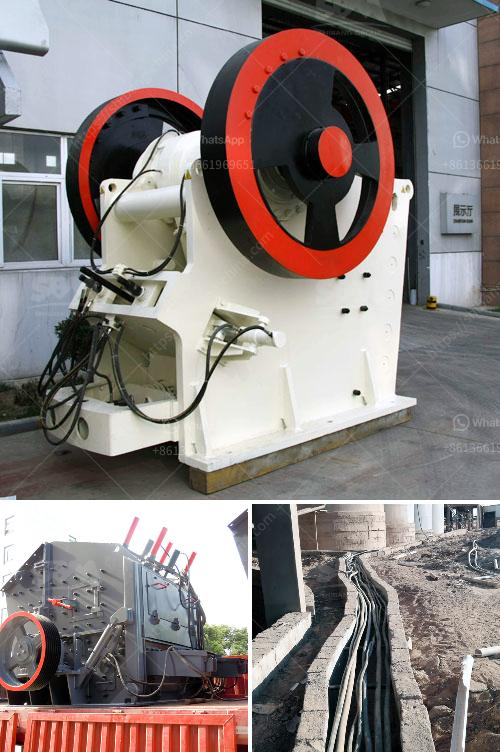

<h3>portable rock crusher for sale</h3>
A portable rock crusher is a machine that can break down large rocks into smaller pieces. Rock crushers are portable machines that are designed to be moved easily. This type of equipment is used to crush or grind rocks into small particles. Crushers can be used to reduce the size or change the shape of materials so that they can be more easily disposed of or recycled.

Portable rock crushers for sale are often used as primary crushers. They are designed to reduce the size of large rocks into smaller rocks such as gravels. Jaw crushers are widely used in the mining and construction industry due to great efficiency in every crushing tasks. They allow operators to crush the materials to a specific size by adjusting the plates at the bottom and capable of moving around the job site by using their own wheels or being pulled by any towing vehicle.

In recent years, the demand for portable rock crushers in the market has increased greatly due to the easy portability and flexibility they provide. These machines have become a popular choice for many contractors and construction companies. They are also widely used in quarrying, mining, recycling, and demolition projects. Portable rock crushers can be used for crushing stones, coal, ores, glass, concrete, and other materials.

The efficiency of portable rock crushers has been greatly improved due to the technological advancements in the field of crushing and screening. One of the most innovative features of portable rock crushers is the ability to change the size of the material being crushed. This can be done using both the sides of the plates or by using a combination of plates and a hydraulic system. By adjusting these settings, operators can achieve the desired size of the final product.

Another advantage of portable rock crushers is that they can be moved from one site to another easily. This is especially useful for contractors who need to move their equipment frequently. Portable crushers can be transported by trucks or trailers, or they can be packed into shipping containers for long-distance transportation. The ease of transport makes it possible for contractors to use their equipment in various locations, providing them with more opportunities for work.

When considering the purchase of a portable rock crusher, it is important to choose a reliable and reputable manufacturer. Look for a company that has been in the industry for several years and has a good reputation for producing quality equipment. Also, ensure that the crusher meets the required safety standards and is equipped with all the necessary safety features.

In conclusion, portable rock crushers for sale have become an essential piece of equipment for contractors and construction companies. They offer the convenience of easy transport and flexibility in crushing materials. With technological advancements, portable rock crushers have become more efficient and can produce high-quality products. When purchasing, make sure to choose a reliable manufacturer and ensure that the crusher meets all necessary safety standards.
<h3>Contact us</h3><ul><li><strong>Whatsapp:&nbsp;<a href="https://wa.me/8613661969651">+8613661969651</a></strong></li><li><a href="https://swt.shibang-china.com/?git&amp;zhl&amp;portable rock crusher for sale"><strong>Online Service(chat now)</strong></a></li></ul><h3>Related</h3><ul><li><a href='silica sand beneficiation plant for glass.md'>silica sand beneficiation plant for glass</a></li><li><a href='difference between pulveriser and.md'>difference between pulveriser and</a></li><li><a href='ball mill ball manufacturer in mumbai.md'>ball mill ball manufacturer in mumbai</a></li><li><a href='crusher jaw crusher.md'>crusher jaw crusher</a></li><li><a href='mineral cribado cantera planta trituradora.md'>mineral cribado cantera planta trituradora</a></li></ul>