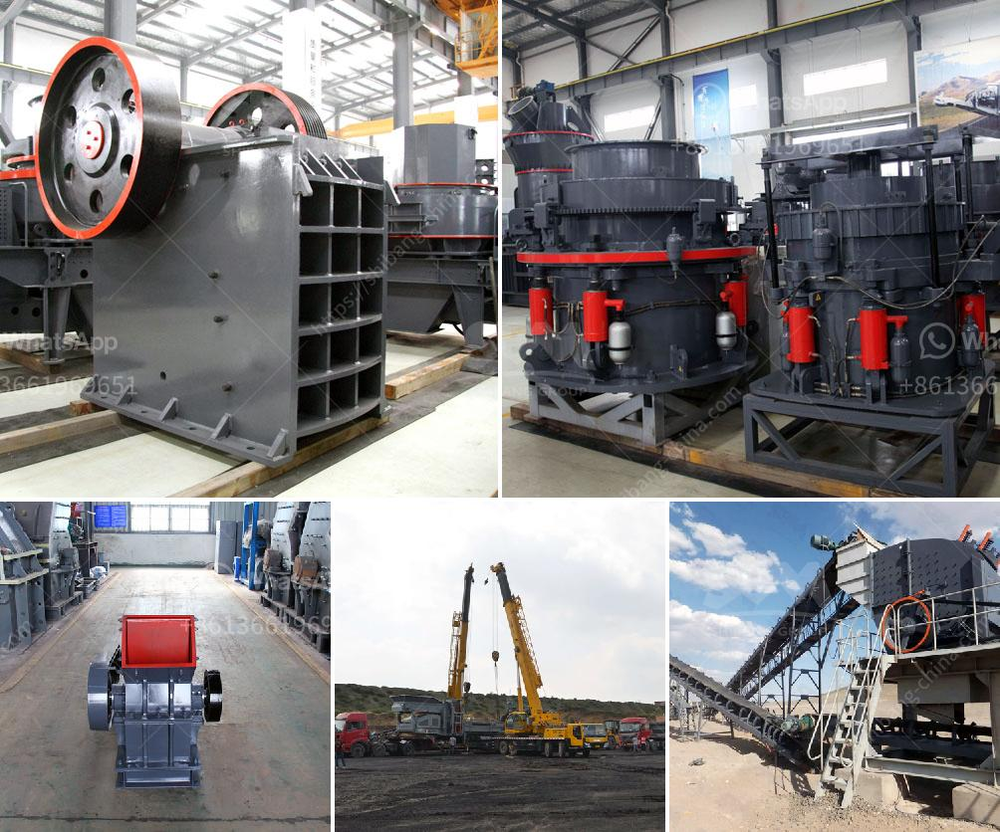

<h3>portable rock crusher</h3>
The portable rock crusher, also known as a mobile stone crushing plant, is a basic crushing system. The portable rock crusher mainly adopts the jaw crusher developed by the company. It is mainly composed of a vibrating feeder, jaw crusher, impact crusher, vibrating screen, belt conveyor, and centralized electric control. The customer can choose the type of portable crusher according to their own needs.

Portable rock crusher has excellent mobility and adaptability of the working site, and it does not need much pre-preparation before the installation of the portable rock crushing station. It saves time and effort, greatly reducing the cost of infrastructure construction and production operation. The portable rock crusher can be directly driven to the working site without transportation and installation. It can be used for on-site crushing of materials, and is also suitable for the operation of various engineering projects such as metallurgy, mining, building materials, and road construction.

The portable rock crusher provides customers with an efficient and low-cost crushing equipment. It can greatly reduce the amount of material that needs to be transported and processed in the production process. Equipped with the advanced equipment, portable rock crusher can easily achieve the production capacity of 200-500 tons/hour. The portable rock crusher is mainly equipped with a vibrating feeder, a jaw crusher, and a belt conveyor. It is widely used in a wide range of applications such as mining, metallurgy, building materials, highways, railways, water conservancy, chemical industry, and etc.

The portable rock crusher has high-efficiency crushing ability for hard materials such as shale, glass, ceramics, bluestone and metal ore, especially in the application of mechanical sand and metal ore. In the sand and gravel production line, the portable rock crusher is often used in combination with the impact crusher, which plays a non-replaceable role in breaking. The portable rock crusher has the advantages of flexible, convenient, high mobility and saving a lot of infrastructure and relocation costs; it can crush rocks, river pebbles, construction waste, limestone, granite, basalt, diabase, andesite, ore tailings, stone chips, etc.

The portable rock crusher has a direct and efficient production flow, integrated production process, simplified process, and uniform particle size of the finished product. Many customers have commented that the portable rock crusher has made a great improvement in crushing efficiency and production flexibility, and the work efficiency of the whole portable rock crusher has been greatly improved. Users can save a lot of time, money and labor costs when operating the portable rock crusher.

In conclusion, the portable rock crusher machine is like a small and medium-sized crushing processing plant, and its working efficiency and operating cost are better than the fixed crusher machines. The main crushers used in tracked portable rock crushers are mainly portable jaw crushers and portable impact crushers. The semi-portable crusher uses on-board traction, which enables the portable crushing plant to meet the mobility requirements both at the job site and on the road. Different modes of HXJQ fixed crusher machine for sale

The portable rock crusher has a high degree of automation and can be used with or without the need for manual intervention. Different types of rock crushers have different operating mechanisms, such as continuous operation mode with single button startup and stop, and easy operation in the automatic control mode. The portable rock crusher is equipped with a remote control system to remotely control the operation of the equipment, saving manpower and time costs.
<h3>Contact us</h3><ul><li><strong>Whatsapp:&nbsp;<a href="https://wa.me/8613661969651">+8613661969651</a></strong></li><li><a href="https://swt.shibang-china.com/?git&amp;zhl&amp;portable rock crusher"><strong>Online Service(chat now)</strong></a></li></ul><h3>Related</h3><ul><li><a href='crusher manufacturers in europe.md'>crusher manufacturers in europe</a></li><li><a href='rock crushers in china.md'>rock crushers in china</a></li><li><a href='density of balls for mills.md'>density of balls for mills</a></li><li><a href='gypsum production plant.md'>gypsum production plant</a></li><li><a href='calcite processing machine.md'>calcite processing machine</a></li></ul>