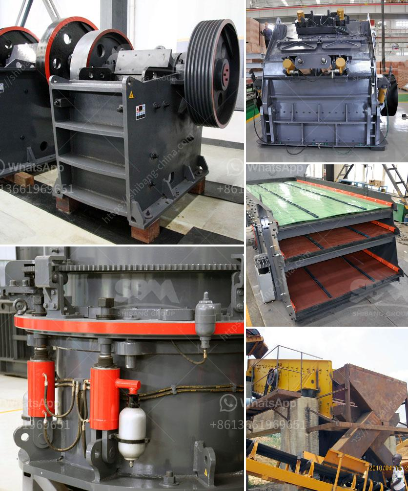

<h3>portable sand grinding machine</h3>
A portable sand grinding machine, also known as a sanding machine, is an efficient tool for grinding and polishing metal surfaces and removing rust from them. This handy tool is compact in size, lightweight, and portable, making it easy to carry and operate. It is a valuable addition to any DIY enthusiast’s toolkit or a professional contractor’s arsenal.

The main function of a portable sand grinding machine is to smooth metal surfaces and prepare them for further finishing. It is equipped with abrasive wheels or sanding discs that rotate at high speed, enabling it to remove material quickly and evenly. These wheels or discs come in various grit sizes, allowing the user to choose the appropriate one based on the severity of the job at hand.

The machine operates using an electric motor, which powers the spinning motion of the abrasive wheel. It is designed to be versatile and adjustable, allowing users to modify the grinding angle and apply the right amount of pressure for different surfaces and materials. Some machines even have adjustable speeds, allowing users to work with greater precision and control.

One of the major advantages of a portable sand grinding machine is its ease of use. It requires minimal setup and can be operated with just a power source and an abrasive wheel. This makes it an ideal choice for people who need to work in remote locations or on-site, where access to a larger grinding machine may not be possible.

Furthermore, its lightweight and portable design make it easy to transport and store. Whether you need to move it from one job site to another or simply want to keep it in your toolbox for occasional use, a portable sand grinding machine can be easily accommodated.

In addition to its convenience, a portable sand grinding machine is also highly effective in removing rust and corrosion from metal surfaces. The abrasive wheels efficiently remove the outer layer of the metal, revealing a clean and polished surface underneath. This is particularly useful for restoring old or worn-out metal objects, such as tools, machinery, or decorative metalwork.

Overall, a portable sand grinding machine is a versatile and valuable tool for anyone working with metal surfaces. Its compact size, lightweight design, and ease of use make it a convenient choice for both professionals and DIY enthusiasts. With its efficient grinding and polishing abilities, it can transform rusty and dull metal surfaces into pristine and shiny ones, enhancing the overall aesthetics and durability of any metal object.

Whether you need to smooth out weld marks, remove rust, or polish metal surfaces, a portable sand grinding machine is an indispensable tool that ensures efficient and high-quality results. Invest in one of these machines and experience the convenience and effectiveness it brings to your metalworking projects.
<h3>Contact us</h3><ul><li><strong>Whatsapp:&nbsp;<a href="https://wa.me/8613661969651">+8613661969651</a></strong></li><li><a href="https://swt.shibang-china.com/?git&amp;zhl&amp;portable sand grinding machine"><strong>Online Service(chat now)</strong></a></li></ul><h3>Related</h3><ul><li><a href='feldspar crusher machine.md'>feldspar crusher machine</a></li><li><a href='small scale gypsum powder production line.md'>small scale gypsum powder production line</a></li><li><a href='limestone crusher limestone crusher equipment.md'>limestone crusher limestone crusher equipment</a></li><li><a href='new stamp mill for sale in zimbabwe.md'>new stamp mill for sale in zimbabwe</a></li><li><a href='slag processing plant in india.md'>slag processing plant in india</a></li></ul>