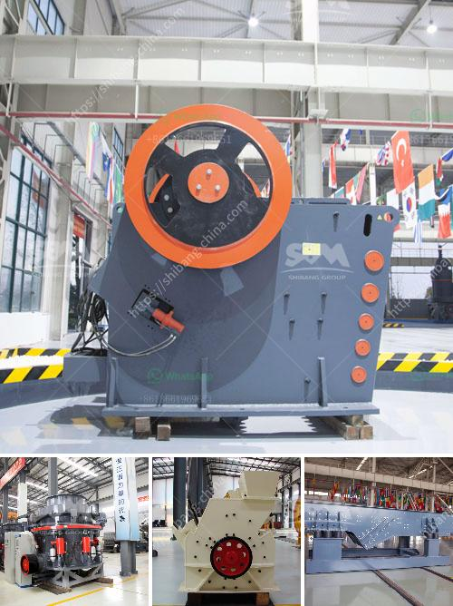

<h3>portable sand screening machine philippines</h3>
The construction industry in the Philippines has been experiencing steady growth over the years. With numerous infrastructure projects being undertaken, the demand for high-quality sand is constantly increasing. However, obtaining the desired quality of sand is not an easy task. It requires efficient screening processes to separate impurities and ensure that only the best-quality sand is used in construction projects. This is where the portable sand screening machines come into play.

Traditional sand screening methods involve manual labor, which is time-consuming, labor-intensive, and often inconsistent in terms of quality. The introduction of portable sand screening machines has revolutionized the construction industry in the Philippines by making the screening process faster, more efficient, and highly accurate.

Portable sand screening machines are compact and lightweight, making them easy to transport and operate in various construction sites. They are designed to quickly and effectively separate sand particles based on their sizes. These machines are equipped with vibrating screens that ensure consistent and uniform screening, delivering high-quality sand that meets the required specifications.

One of the key advantages of portable sand screening machines is their ability to handle a wide range of sand types. They can screen various types of sands, including river sand, crushed sand, natural sand, and manufactured sand. This versatility makes them suitable for use in a wide range of construction projects, from road construction to building construction and even landscaping.

Furthermore, these machines are equipped with adjustable screens that allow for precise control over the screening process. This ensures that the desired sand particle size is achieved, providing construction teams with greater flexibility in meeting specific project requirements.

The economic benefits of portable sand screening machines are also significant. By eliminating the need for manual labor, construction teams can save time and reduce labor costs. The machines also have high screening capacities, allowing for greater quantities of sand to be processed in a shorter amount of time. This leads to increased productivity and faster project completion.

Moreover, the use of portable sand screening machines promotes environmental sustainability. These machines are designed to minimize dust emissions and noise pollution, creating a more efficient and eco-friendly screening process. Additionally, the reduction in the extraction of raw materials through efficient screening contributes to the conservation of natural resources in the long run.

In conclusion, portable sand screening machines have become a game-changer in the construction industry in the Philippines. They offer numerous benefits, such as faster and more efficient screening, high-quality sand production, and cost savings. Their portability, versatility, and eco-friendly features make them an essential tool for construction projects of all sizes. As the demand for high-quality sand continues to grow, the use of portable sand screening machines will undoubtedly become more prevalent, shaping the future of the construction industry in the Philippines.
<h3>Contact us</h3><ul><li><strong>Whatsapp:&nbsp;<a href="https://wa.me/8613661969651">+8613661969651</a></strong></li><li><a href="https://swt.shibang-china.com/?git&amp;zhl&amp;portable sand screening machine philippines"><strong>Online Service(chat now)</strong></a></li></ul><h3>Related</h3><ul><li><a href='tonnes per year cement plant machinary.md'>tonnes per year cement plant machinary</a></li><li><a href='stone crusher machine in zimbabwe.md'>stone crusher machine in zimbabwe</a></li><li><a href='gold stamp mill manufacturer in china.md'>gold stamp mill manufacturer in china</a></li><li><a href='fine powder grinders machine.md'>fine powder grinders machine</a></li><li><a href='construction aggregates crusher.md'>construction aggregates crusher</a></li></ul>