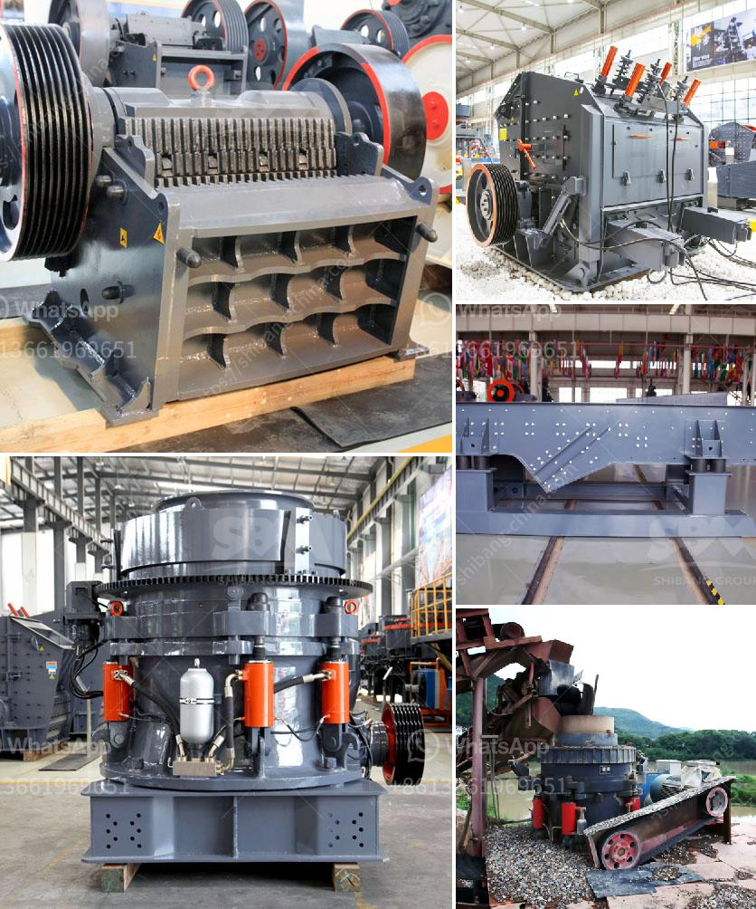

<h3>portable stone crusher and prices</h3>
A portable stone crushing machine is a very valuable asset for construction companies and homeowners alike. This piece of equipment allows contractors to separate and crush different types of materials whenever and wherever they need to. However, in order to get the most out of their investment, it's important for users to understand the prices associated with portable stone crushers.

The prices of these machines are influenced by several factors. Firstly, the manufacturer or supplier plays a significant role in determining the price tag. Different manufacturers offer crushers with varying quality levels and features, which can impact the price. It's important for buyers to do their research and choose a reputable manufacturer that offers a balance between quality and affordability.

Another factor that affects the price is the specifications of the portable stone crusher. Different crushers have different capacity levels, production rates, and power requirements. It's important to choose a crusher that matches the intended application and production needs. Higher-capacity crushers tend to have higher prices.

Furthermore, additional features such as mobility options, remote control capabilities, and the presence of a screening system can also affect the price. These added features enhance the convenience and efficiency of the crusher but may come at a higher cost.

Lastly, the market conditions and demand for portable stone crushers also impact the prices. Fluctuations in raw material costs, availability, and overall demand for these machines can lead to variations in prices over time.

Despite the varying prices, portable stone crushers are generally deemed cost-effective investments. They eliminate the need for transporting materials to a centralized crushing site, saving both time and money. Moreover, the on-site crushing capabilities allow users to produce materials directly at the construction site, reducing the need for additional machinery and labor.

In conclusion, portable stone crushers offer construction companies and homeowners the flexibility to crush materials on-site, saving time and money. Understanding the factors that influence the prices of these machines, such as the manufacturer, specifications, additional features, and market conditions, is crucial for making an informed purchasing decision. It's always recommended to compare prices and features from different suppliers to ensure getting the best value for money.
<h3>Contact us</h3><ul><li><strong>Whatsapp:&nbsp;<a href="https://wa.me/8613661969651">+8613661969651</a></strong></li><li><a href="https://swt.shibang-china.com/?git&amp;zhl&amp;portable stone crusher and prices"><strong>Online Service(chat now)</strong></a></li></ul><h3>Related</h3><ul><li><a href='how to start stone crusher unit in kenya.md'>how to start stone crusher unit in kenya</a></li><li><a href='auto cad ball mill.md'>auto cad ball mill</a></li><li><a href='jaw crusher diagram.md'>jaw crusher diagram</a></li><li><a href='crushing efficiency of ball mill.md'>crushing efficiency of ball mill</a></li><li><a href='ball mill prices and for sale ghana.md'>ball mill prices and for sale ghana</a></li></ul>