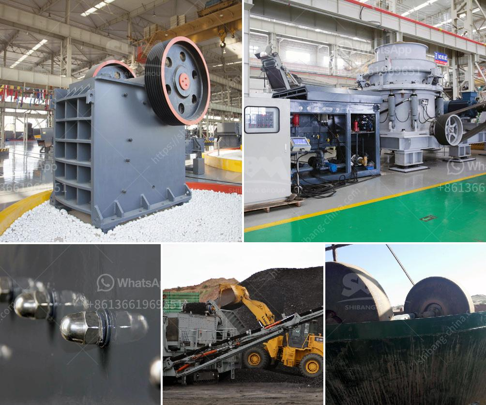

<h3>portable stone crusher machine for sale</h3>
Portable stone crusher machine is the new type of crushing equipment. Such type of crushing equipment is very convenient to move from one quarrying site to another. Limestone grinding mill for sale plays an important role in the whole plant. The portable stone crusher machine is composed of vibrating feeder, vibrating screen, jaw crusher, impact crusher, belt conveyor and electric control panel. Its capacity is 50-500t/h, which means it can be used to crush stones of different hardness.

It is mainly used in metallurgy, mining, chemical, cement, construction, refractory materials and ceramic industries as well as broken and finely various kinds of hard with rocks and ores. In the same industry, it is often used before ball mill machine to increase throughput of ball mill machines. The vibrating feeder can evenly feed materials for the crushing equipment in the sand production line, and screen materials roughly. It can also serve materials for belt conveyors, bucket elevator, screening equipment, crushing equipment and grinding machines.

Stone crusher machine can be divided into different types depending on the different application, usage, capacity and raw material characteristics. The main stone crusher types refer to: jaw crusher, cone crusher, impact crusher and VSI crusher, hammer crusher or reversible hammer crusher, etc. When choosing stone crusher for sale, it is better to choose suitable machine according to the specific conditions.

In industry, it is seldom used alone, consequently, it is commonly employed to crushing hard materials in the size of 8-120 tph according to stone size of 200mm and output size of 30mm or greater than 30mm. It can be used in many industries like mining, construction, etc., so it is not easy to understand the specific requirements of each industry, but the following can provide you with a reference.

In construction industry, for example, it is predominantly used for producing construction sand and stone. It works in the sand-making production line. The stone crusher quickly moves to work site and uses its integral crushing system to crush stone or demolition waste. VSI crusher is widely used in the use of high-speed railway construction, municipal engineering, the construction of roads to provide high-grade sand and gravel aggregate performance advantages.

The hammer crusher or reversible possesses a grain size range of 1mm and a capacity of approx. 10 t/h - 100 t/h. Different flywheels drive, the reversible hammer are handcuffed both to the hub part and the rotor shaft. And the flywheel is mounted on the driving side of the wheel, greatly improving the service life of the machine.

In conclusion, portable stone crusher machine is really a good choice for small and medium-sized mining, cement, refractory, one component of the stone is lower than the console height, so it is convenient to move. Secondly, portable stone crusher machine is able to move freely, it is perfectly in good performance and conveniently for maintenance, etc. Therefore, portable stone crusher machine is increasingly popular among countries.
<h3>Contact us</h3><ul><li><strong>Whatsapp:&nbsp;<a href="https://wa.me/8613661969651">+8613661969651</a></strong></li><li><a href="https://swt.shibang-china.com/?git&amp;zhl&amp;portable stone crusher machine for sale"><strong>Online Service(chat now)</strong></a></li></ul><h3>Related</h3><ul><li><a href='cost of barite crusher in nigeria.md'>cost of barite crusher in nigeria</a></li><li><a href='list of machinery for 3000 tonnes per hour crusher.md'>list of machinery for 3000 tonnes per hour crusher</a></li><li><a href='schredder and grinding mille for sale.md'>schredder and grinding mille for sale</a></li><li><a href='sand washing plant for sale in uae.md'>sand washing plant for sale in uae</a></li><li><a href='rubble recycling machine in china.md'>rubble recycling machine in china</a></li></ul>