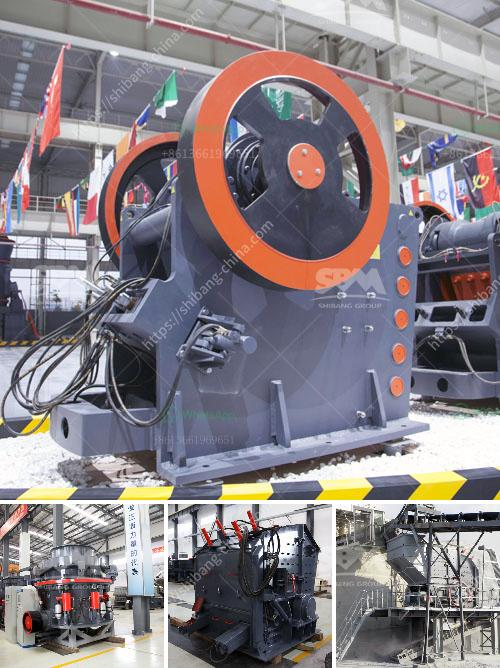

<h3>powder making machine price in pakistan</h3>
Powder making machines are widely used for grinding minerals into powders. In Pakistan, it is among the booming industries for powder production. Many industries and individuals are using powder making machines to grind various materials into powders for different purposes. The powder making machine price in Pakistan depends on its capacity, size, materials used, features, functions, and performance. In this article, we will discuss the price range of powder making machines available in Pakistan.

Powder making machines are used in various industries such as pharmaceuticals, food processing, chemical, construction, and many more. These machines are essential for grinding different materials like grains, herbs, minerals, and spices into fine powders. The demand for powder making machines has increased significantly, leading to a surge in their prices in Pakistan.

The price of powder making machines in Pakistan can vary depending on the capacity and size. Small capacity machines with minimal features are comparatively affordable, ranging from Rs. 20,000 to Rs. 50,000. However, these machines are suitable for small-scale businesses or home use. They are not suitable for heavy-duty grinding or commercial purposes.

On the other hand, high-capacity powder making machines with advanced features and functions are more expensive. These machines can cost anywhere from Rs. 100,000 to Rs. 500,000 or even more. The price may also vary based on the brand reputation and quality of materials used in manufacturing the machine. These machines are ideal for large-scale businesses and industries.

Apart from capacity, the size of the machine also plays a significant role in determining its price. Compact and portable machines are usually cheaper compared to larger models due to their reduced capacity. However, larger machines are more efficient and can grind a greater quantity of materials in less time, making them more suitable for industrial use.

Materials used in manufacturing the machine also affect its price. Machines made from high-quality stainless steel are usually more expensive compared to those made from mild steel or other less durable materials. Stainless steel machines are known for their longevity, hygienic properties, and resistance to corrosion, making them a popular choice for commercial use.

Furthermore, additional features and functions can also contribute to a higher price. Some powder making machines come with multiple grinding chambers, automatic feeding mechanisms, and adjustable particle sizes, which increases their cost. These machines offer more versatility and convenience in grinding different materials with precise control over the final output.

It is essential to consider the performance and reliability of the machine before making a purchase. The reputation and customer reviews of the manufacturer can serve as a reliable indicator of the machine's quality. Investing in a reliable and high-quality powder making machine ensures efficient and long-lasting performance, reducing maintenance costs and downtime.

In conclusion, the price of powder making machines in Pakistan varies based on capacity, size, materials used, features, functions, and performance. Small capacity machines are relatively affordable, while high-capacity machines with advanced features are expensive. Additionally, the size, materials, and additional functions also affect the price. It is important to consider the requirements and budget before making a purchase to ensure the best value for money investment.
<h3>Contact us</h3><ul><li><strong>Whatsapp:&nbsp;<a href="https://wa.me/8613661969651">+8613661969651</a></strong></li><li><a href="https://swt.shibang-china.com/?git&amp;zhl&amp;powder making machine price in pakistan"><strong>Online Service(chat now)</strong></a></li></ul><h3>Related</h3><ul><li><a href='charcoal making machine south africa.md'>charcoal making machine south africa</a></li><li><a href='crusher plants for sale in pakistan.md'>crusher plants for sale in pakistan</a></li><li><a href='gold refining equipment machine plant.md'>gold refining equipment machine plant</a></li><li><a href='used limestone pulverizers crusher for sale texas.md'>used limestone pulverizers crusher for sale texas</a></li><li><a href='hammer mills for sale at saro zambia.md'>hammer mills for sale at saro zambia</a></li></ul>