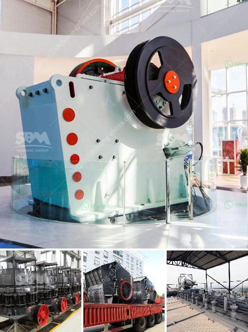

<h3>powder mill grinding machine in nigeria</h3>
In recent years, the Nigerian economy has witnessed a significant boost, thanks to the continuous rise in industrial and manufacturing sectors. This has led to a surge in the demand for raw materials, such as coal, limestone, iron ore, and many others. In particular, the country has a vast reserve of mineral resources, which have opened up new opportunities for local entrepreneurs and investors.

One such sector that has seen remarkable growth is the powder mill grinding industry. This industry primarily focuses on the production of fine and ultra-fine powders for various applications, including pharmaceuticals, cosmetics, food processing, and advanced materials production. Powder mill grinding machines offer versatility in terms of materials they can process and the fineness achievable with each grind.

Nigeria's mining sector plays a crucial role in the country's economic development. With the discovery of vast mineral deposits, mining activities have ramped up significantly, leading to increased demand for powder mill grinding machines. These machines are used to grind and crush various raw materials into fine and ultra-fine powders, making them suitable for a wide range of applications.

One key advantage of powder mill grinding machines is their ability to produce high-quality and consistent outputs. These machines utilize advanced grinding techniques, such as ball milling, jet milling, and ultra-fine milling, to achieve particle sizes as low as a few micrometers. This ensures that the powders produced are uniform, with the desired particle size distribution, and free from impurities.

Furthermore, powder mill grinding machines in Nigeria are also equipped with advanced automation features, allowing for easy operation and maintenance. These machines are designed with safety interlocks and protective measures to ensure operator safety and prevent accidental damage. This makes them user-friendly and ideal for both small-scale and large-scale production.

The application of powder mill grinding machines in various industries is vast. For instance, in the pharmaceutical sector, these machines are used to produce fine powders for tablet manufacturing, as well as for the production of excipients and active pharmaceutical ingredients. In the cosmetics industry, these machines are utilized to grind raw materials, such as minerals and pigments, to produce fine powders for makeup and skincare products.

The food processing industry also benefits greatly from powder mill grinding machines in Nigeria. These machines are used to grind and process various ingredients, such as spices, grains, and herbs, into fine powders for seasoning, baking, and food flavoring applications. Additionally, the machines can also be used for the production of powdered milk, coffee, and other powdered beverages.

In conclusion, the powder mill grinding machine industry in Nigeria presents a promising investment opportunity. With abundant mineral resources and increasing demand for fine and ultra-fine powders in various industries, entrepreneurs and investors can tap into this sector to meet the growing market needs. The advancement in grinding technologies and automation features of these machines make them efficient, reliable, and cost-effective. By leveraging this sector, Nigeria can boost its industrial growth and contribute to the nation's overall economic development.
<h3>Contact us</h3><ul><li><strong>Whatsapp:&nbsp;<a href="https://wa.me/8613661969651">+8613661969651</a></strong></li><li><a href="https://swt.shibang-china.com/?git&amp;zhl&amp;powder mill grinding machine in nigeria"><strong>Online Service(chat now)</strong></a></li></ul><h3>Related</h3><ul><li><a href='nigeria c125 jaw crusher.md'>nigeria c125 jaw crusher</a></li><li><a href='big impact crusher 1000 ton per hour.md'>big impact crusher 1000 ton per hour</a></li><li><a href='mining equipment tanzania.md'>mining equipment tanzania</a></li><li><a href='mining equipment for sale harare zimbabwe.md'>mining equipment for sale harare zimbabwe</a></li><li><a href='jaw stone crusher for excavators.md'>jaw stone crusher for excavators</a></li></ul>