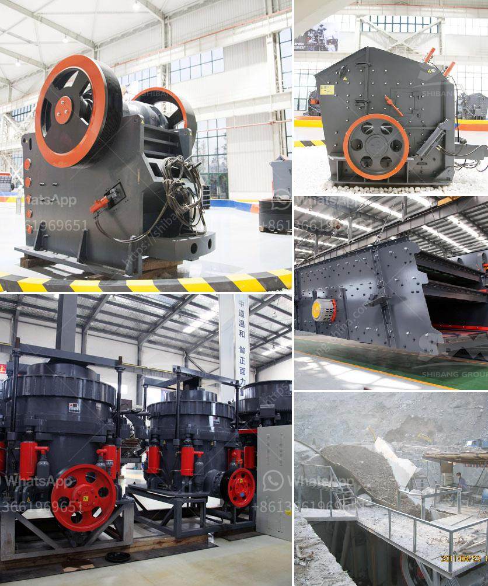

<h3>price crusher mill price stone crusher</h3>
Price crusher mills, also known as stone crusher, have been in use for centuries. These machines are utilized in a variety of industries, including mining, construction, and waste management. The primary purpose of a crusher mill is to reduce the size of large rocks or debris into smaller pieces that can be used for various purposes.

When it comes to purchasing a crusher mill, price is a crucial factor to consider. The cost of this equipment can vary significantly depending on factors such as size, capacity, and features. In this article, we will explore the price range of crusher mills and discuss the factors that influence their costs.

Price crusher mills come in a wide range of sizes and capacities, from compact models suitable for small-scale operations to large machines capable of handling massive amounts of material. The size and capacity of the mill directly affect its price. Generally, larger mills with higher capacity come with a higher price tag.

Another factor that influences the price of crusher mills is the quality of materials used in their construction. High-quality mills are usually made of durable materials, such as stainless steel or cast iron, which can withstand heavy use and ensure long-term performance. However, these mills tend to be more expensive compared to those made of lower-quality materials.

The technology and features incorporated into a crusher mill also affect its price. Advanced models often come with automated controls, multiple speed settings, and safety features to enhance the user's experience and improve productivity. Such mills can be more expensive than basic models with minimal features.

In addition to the initial purchase price, it is essential to consider the maintenance and operating costs associated with a crusher mill. Some mills require regular maintenance, such as lubrication, blade replacement, or cleaning, which can incur additional expenses over time. It is advisable to choose a mill with low maintenance requirements to minimize long-term costs.

When comparing prices of crusher mills from different manufacturers, it is essential to consider the reputation and reliability of the brand. Well-established manufacturers with a history of producing high-quality equipment tend to charge higher prices but offer superior performance and durability. On the other hand, lesser-known brands may offer more affordable options, but their quality and performance may not be as reliable.

It is also worth noting that prices for crusher mills can vary geographically. Factors such as import/export taxes, shipping costs, and local market demand can influence the final price of these machines. Therefore, it is crucial to research and compare prices from different suppliers to find the best deal.

In conclusion, when purchasing a price crusher mill, it is important to consider various factors that influence its cost. These factors include size, capacity, materials used, features, maintenance requirements, brand reputation, and geographical location. By carefully assessing these factors and comparing prices from different suppliers, one can find a crusher mill that meets their needs and budget.
<h3>Contact us</h3><ul><li><strong>Whatsapp:&nbsp;<a href="https://wa.me/8613661969651">+8613661969651</a></strong></li><li><a href="https://swt.shibang-china.com/?git&amp;zhl&amp;price crusher mill price stone crusher"><strong>Online Service(chat now)</strong></a></li></ul><h3>Related</h3><ul><li><a href='list of mineral processing plants in oman.md'>list of mineral processing plants in oman</a></li><li><a href='jaw crusher manufacturers in gujarat.md'>jaw crusher manufacturers in gujarat</a></li><li><a href='roller mill for ares.md'>roller mill for ares</a></li><li><a href='cs series cone crusher agents in south africa.md'>cs series cone crusher agents in south africa</a></li><li><a href='gypsum machinery plant from france.md'>gypsum machinery plant from france</a></li></ul>