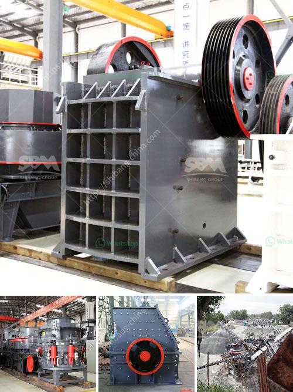

<h3>price hammer mill price mining</h3>
In the mining industry, the usage of hammer mills is quite common due to its versatility and reliability. These machines are preferred by miners as they efficiently break down materials into finer particles required for different applications. However, one crucial factor that influences the decision to invest in a hammer mill is its price.

The price of a hammer mill can vary significantly based on several factors. One of the primary determinants is the size of the machine. Smaller models suitable for small-scale mining operations are generally more affordable than larger, industrial-grade mills designed for large-scale mining enterprises. The size of the hammer mill typically dictates its capacity and power requirements, which directly influence its price.

Another critical factor affecting the price of hammer mills is the material and quality of construction. Hammer mills are subject to heavy wear and tear due to the abrasive nature of the materials they process. As a result, they are typically made from high-strength steel or alloys. The quality of the material used directly affects the durability and longevity of the mill. A higher-quality construction may come at a higher price but also offers extended machine life and reduced maintenance costs, making it a valuable long-term investment for a mining operation.

Additional features and capabilities can also impact the price of hammer mills. For instance, some mills come with advanced control systems and automation, allowing operators to optimize their milling processes and increase productivity. Such advanced features can drive up the price of the equipment but may provide substantial benefits in terms of efficiency and overall operational costs over time.

The availability and cost of spare parts and maintenance services should also be considered when evaluating the price of a hammer mill. Having easy access to genuine spare parts and reliable maintenance services ensures that the mill can be kept in optimal condition, reducing the risk of downtime and increasing its lifespan. This, in turn, can offset the initial investment by reducing long-term maintenance and repair expenses.

Finally, the brand reputation and market demand can also affect the price of hammer mills. Established brands with a proven track record of delivering high-quality and dependable equipment usually command a premium price. However, investing in a reputable brand often provides peace of mind, knowing that the mill is backed by strong customer support and a robust warranty, minimizing the risk of unexpected breakdowns and financial losses.

In conclusion, the price of a hammer mill in the mining industry varies according to several factors. These include the size, construction quality, additional features, availability of spare parts and maintenance services, and the brand reputation of the manufacturer. While it is essential to consider the price, it is equally important for miners to assess the overall value and longevity offered by the equipment before making a purchase decision. Investing in a durable, efficient, and reliable hammer mill is crucial to ensure uninterrupted mining operations and maximize returns on investment.
<h3>Contact us</h3><ul><li><strong>Whatsapp:&nbsp;<a href="https://wa.me/8613661969651">+8613661969651</a></strong></li><li><a href="https://swt.shibang-china.com/?git&amp;zhl&amp;price hammer mill price mining"><strong>Online Service(chat now)</strong></a></li></ul><h3>Related</h3><ul><li><a href='slag processing plant in india.md'>slag processing plant in india</a></li><li><a href='hydraulic cone crusher price.md'>hydraulic cone crusher price</a></li><li><a href='5 ton per hour mobile gold process mill.md'>5 ton per hour mobile gold process mill</a></li><li><a href='used gold mining equipment for sale in south africa.md'>used gold mining equipment for sale in south africa</a></li><li><a href='small scale crushing plant.md'>small scale crushing plant</a></li></ul>