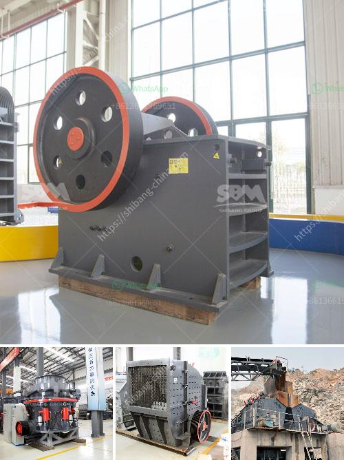

<h3>price kenya crushers</h3>
In the construction industry, the need for high-quality materials is paramount. And with the ever-increasing demand for construction materials, the importance of efficient crushing equipment cannot be undermined. Crushers play a vital role in the production of aggregates, which are essential in various construction projects, including roads, buildings, and bridges.

Kenya, known for its robust construction industry, has seen a surge in the demand for crushers as the country aims to build a resilient infrastructure to support its economic growth. This has led to a rise in the number of crusher manufacturers in the country. However, when it comes to choosing crushers, there are a few key factors to consider, one of which is price.

The price of crushers in Kenya varies depending on the type, capacity, and specific features. Crushers can be categorized into different types such as primary, secondary, and tertiary crushers based on their usage and purpose. Primary crushers are designed to break down large stones into smaller pieces for further processing. Secondary crushers are used to refine the crushed material, and tertiary crushers are used to produce finer aggregate particles.

In Kenya, there is a wide variety of crushers available, ranging in size from a few tons to several hundred tons per hour. With such a wide selection, it is easier than ever to find the crusher that best suits your requirements and budget.

In Nairobi, the best affordable crushers are those from the house of Arkay. Arkay crushers are known for their reliability, durability, and high-quality output. These crushers are manufactured using top-quality materials and the latest technology, ensuring that they can withstand the toughest conditions and deliver consistent performance.

The price of Arkay crushers varies depending on the specific model and capacity. For instance, a small to medium-sized crusher can cost around KSh 800,000 to KSh 1.5 million, while a large crusher can cost upwards of KSh 10 million. It is important to note that these prices are approximate and may vary depending on the seller, location, and any additional features or attachments required.

Apart from the initial investment, it is also crucial to consider the operational costs associated with the crusher. These costs include fuel or electricity consumption, maintenance, and spare parts. Arkay crushers are designed to be energy-efficient, helping to reduce operational costs in the long run. Additionally, Arkay offers excellent after-sales service, including easy availability of spare parts and prompt maintenance support.

Before purchasing a crusher, it is always recommended to do thorough research, compare prices, and evaluate the specific needs of your project. It is also advisable to consult with experts in the field who can guide you in making an informed decision.

In conclusion, the price of crushers in Kenya depends on various factors, including type, capacity, and specific features. Arkay crushers are an excellent choice for construction projects, as they offer durability, reliability, and high-quality output. While the initial investment may seem significant, the long-term benefits and cost savings justify the price. With the right crusher, construction projects can be completed efficiently, ensuring the creation of strong and reliable infrastructure in Kenya.
<h3>Contact us</h3><ul><li><strong>Whatsapp:&nbsp;<a href="https://wa.me/8613661969651">+8613661969651</a></strong></li><li><a href="https://swt.shibang-china.com/?git&amp;zhl&amp;price kenya crushers"><strong>Online Service(chat now)</strong></a></li></ul><h3>Related</h3><ul><li><a href='stone crushers suppliers in south africa.md'>stone crushers suppliers in south africa</a></li><li><a href='stone pulverizer machine.md'>stone pulverizer machine</a></li><li><a href='vail crushing meachine models in pharma.md'>vail crushing meachine models in pharma</a></li><li><a href='quarry machine and crusher plant sale in philippines.md'>quarry machine and crusher plant sale in philippines</a></li><li><a href='jaw crusher vs gyratory crusher stone crusher quarry.md'>jaw crusher vs gyratory crusher stone crusher quarry</a></li></ul>