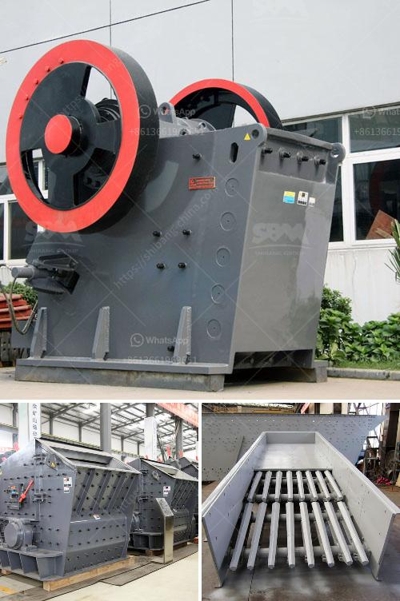

<h3>price list coal crushing plant</h3>
Coal has been a reliable source of energy for several decades now. It is used in many industries such as power generation, cement manufacturing, steel production, and various other applications. Therefore, it plays a significant role in the global economy. To meet the growing demand for coal, coal crushing plants are essential.

A coal crushing plant is an assemblage of equipment that combines various types of machinery, including conveyor, screening, and pulverizing devices. It reduces the quantity of waste or coal slurry during the process, achieving recovery and coal grade improvement. The crushing plant consists of a feed hopper, belt feeder, coal trommel screen, and support structure.

When investing in a coal crushing plant, it’s crucial to consider the overall budget, production capacity, and desired final product size. The price list of a coal crushing plant typically includes the following factors:

1. Stationary or portable crushing plant: Although a portable crushing plant can be relocated more easily, it lacks the ability to be fully automated. Therefore, the initial investment cost of the stationary plant is higher compared to the portable one.

2. Size and capacity: The size and capacity of the plant significantly affect the price. A higher capacity plant will usually have a higher price tag, as it can process more coal and produce a larger quantity of the final product.

3. Quality of components: The price list also considers the quality of components used in the crushing plant. Higher-quality components, such as bearings, motors, and screens, may have a higher initial cost but can provide better performance, reliability, and durability.

4. Automation level: The level of automation in the plant influences its price. An automated plant, equipped with advanced control systems and sensors, reduces the need for continuous human intervention, resulting in higher efficiency and decreased production costs.

5. Supplier reputation: The reputation and credibility of the supplier also have an impact on the price of the coal crushing plant. A supplier with a proven track record of providing high-quality equipment and excellent after-sales service may charge a premium.

In conclusion, a coal crushing plant is a vital investment for any company in the mining industry. The overall price of the plant, including installation and maintenance costs, depend on the quality, capacity, automation level, and supplier reputation. While it may be tempting to opt for a lower-priced plant, it is crucial to prioritize long-term benefits such as efficiency, reliability, and durability. By considering these factors, companies can make an informed decision and invest in a coal crushing plant that meets their requirements while providing a good return on investment.
<h3>Contact us</h3><ul><li><strong>Whatsapp:&nbsp;<a href="https://wa.me/8613661969651">+8613661969651</a></strong></li><li><a href="https://swt.shibang-china.com/?git&amp;zhl&amp;price list coal crushing plant"><strong>Online Service(chat now)</strong></a></li></ul><h3>Related</h3><ul><li><a href='ball mill design calculation.md'>ball mill design calculation</a></li><li><a href='advantages of hammer mill.md'>advantages of hammer mill</a></li><li><a href='machinery in limestone production.md'>machinery in limestone production</a></li><li><a href='price crusher mill price stone crusher.md'>price crusher mill price stone crusher</a></li><li><a href='quarry crusher machine manufacturing company in malaysia.md'>quarry crusher machine manufacturing company in malaysia</a></li></ul>