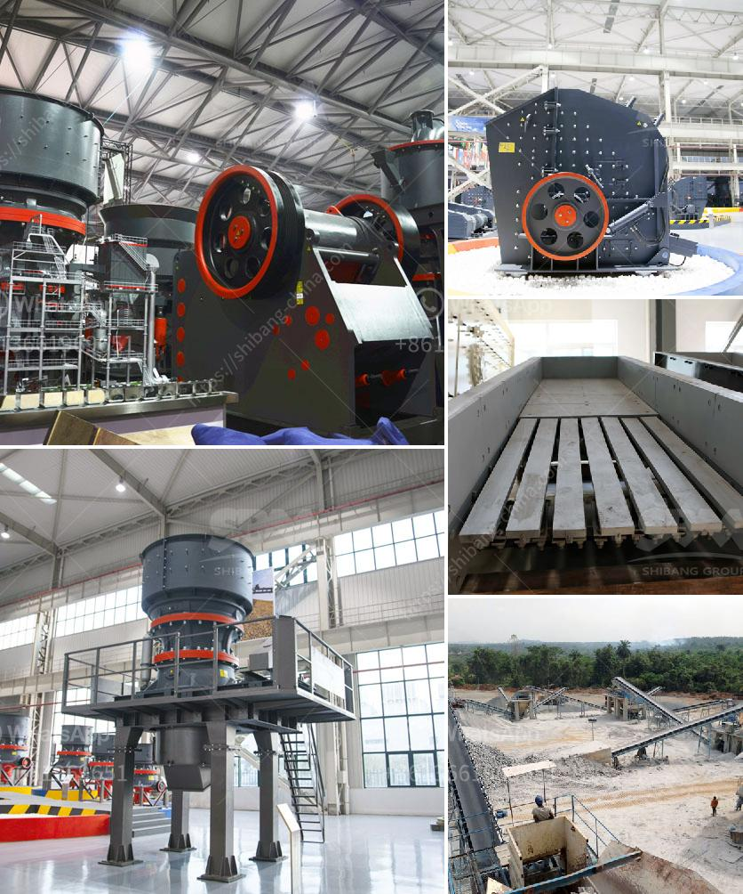

<h3>price list of washing of rock phosphate</h3>
Rock phosphate is a valuable source of phosphorus that is widely used in the agricultural industry as a fertilizer. To make it suitable for use, the raw rock phosphate needs to be processed and purified through a washing process. The price of washing rock phosphate can vary depending on various factors, including the quality of the rock phosphate, the location of the washing facility, and market demand. In this article, we will explore the price list of washing rock phosphate and its implications for farmers and the fertilizer industry.

The price of washing rock phosphate is primarily influenced by the quality of the raw material. Rock phosphate with a higher concentration of phosphorus and lower impurity levels tends to command a higher price. The washing process removes unwanted impurities, such as heavy metals and carbonates, to improve the quality of the final product. This purification step adds value to the rock phosphate and contributes to its higher price.

Another important factor that affects the price of washing rock phosphate is the location of the washing facility. Transporting large quantities of rock phosphate over long distances can be costly. Therefore, washing facilities located closer to the source of rock phosphate tend to offer more competitive prices. Additionally, proximity to transportation infrastructure, such as ports and railways, can also play a role in determining the price of washing services.

Market demand also plays a significant role in determining the price of washing rock phosphate. If there is high demand for the product, washing facilities may charge a premium for their services. Conversely, during periods of low demand, prices may be more competitive as facilities compete for customers. Additionally, fluctuations in the global phosphate fertilizer market can also influence the price of washing rock phosphate.

The price of washing rock phosphate can vary widely depending on the factors mentioned above. On average, the cost of washing rock phosphate ranges from $50 to $200 per metric ton. However, certain high-quality rock phosphates, such as those with a phosphorus content above 30%, may command prices of up to $500 per metric ton. It is important for farmers and fertilizer manufacturers to carefully assess the quality and price of washed rock phosphate to make informed decisions about its use in their operations.

In conclusion, the price list of washing rock phosphate is influenced by the quality of the raw material, the location of the washing facility, and market demand. The cost of washing rock phosphate can range from $50 to $200 per metric ton, depending on these factors. Farmers and fertilizer manufacturers should consider the quality and price of washed rock phosphate to ensure its cost-effectiveness in their agricultural practices.
<h3>Contact us</h3><ul><li><strong>Whatsapp:&nbsp;<a href="https://wa.me/8613661969651">+8613661969651</a></strong></li><li><a href="https://swt.shibang-china.com/?git&amp;zhl&amp;price list of washing of rock phosphate"><strong>Online Service(chat now)</strong></a></li></ul><h3>Related</h3><ul><li><a href='price of conveyor belt 6 meters.md'>price of conveyor belt 6 meters</a></li><li><a href='rock crusher portable.md'>rock crusher portable</a></li><li><a href='raymond mill vs ball mill.md'>raymond mill vs ball mill</a></li><li><a href='crushing  screening plant.md'>crushing & screening plant</a></li><li><a href='rock crusher suppliers in malaysia.md'>rock crusher suppliers in malaysia</a></li></ul>