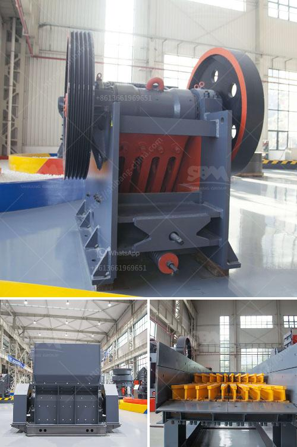

<h3>price of conveyor belt 6 meters</h3>
Conveyor belts are an integral part of various industries, serving to transport goods and materials efficiently and smoothly. Whether it is in manufacturing plants, airports, or warehouses, these belts play a crucial role in streamlining operations. However, the price of a conveyor belt depends on various factors, such as its length, width, material, and additional features. In this article, we will focus on the price of a 6-meter conveyor belt.

The length is one of the primary factors influencing the cost of a conveyor belt. A 6-meter belt is relatively shorter in length compared to longer belts used in larger facilities. This typically leads to a lower cost as fewer materials are needed for its construction. However, the cost of manufacturing and material quality can still impact the price.

Another important consideration is the width of the belt. Width typically ranges between 200mm to 2,000mm, with wider belts being more expensive. A wider belt has the advantage of carrying larger loads, thus increasing productivity. Nonetheless, for a 6-meter conveyor belt, a width of around 500mm to 800mm is usually sufficient. This width range strikes a balance between cost and functionality.

The material used in the construction of a conveyor belt also plays a significant role in determining its price. Conveyor belts are commonly made of rubber or various synthetic materials such as nylon, polyester, or polyurethane. Rubber belts tend to be more economical, especially for shorter lengths, while synthetic materials are often preferred for their durability and resistance to heat and chemicals. Therefore, the choice of material will affect the overall cost of the belt.

Conveyor belts may also come with additional features or modifications, further impacting the price. For example, if the belt needs to be flame-resistant, oil-resistant, or have excellent tensile strength, it may require special manufacturing processes or the addition of specific materials. These modifications often add to the cost of the conveyor belt.

Lastly, the reputation of the manufacturer or supplier can influence the price of a conveyor belt. Established companies with a track record of producing high-quality and reliable belts may charge more for their products. However, investing in a reputable brand can ensure durability and longevity, reducing the need for frequent replacements and maintenance costs in the long run.

The price range for a 6-meter conveyor belt can vary depending on the aforementioned factors. On average, one can expect prices to range between $1,000 to $3,000. However, it is important to request detailed quotes from different suppliers to get a more accurate estimate tailored to one's specific requirements.

In conclusion, the price of a 6-meter conveyor belt is influenced by various factors, including its length, width, material used, additional features, and the reputation of the manufacturer. While shorter belts may be less costly, it is crucial to consider the specific needs of the industry and invest in a durable and reliable belt for efficient operations. Therefore, it is recommended to compare quotes from different suppliers and prioritize quality over solely focusing on cost when purchasing a conveyor belt.
<h3>Contact us</h3><ul><li><strong>Whatsapp:&nbsp;<a href="https://wa.me/8613661969651">+8613661969651</a></strong></li><li><a href="https://swt.shibang-china.com/?git&amp;zhl&amp;price of conveyor belt 6 meters"><strong>Online Service(chat now)</strong></a></li></ul><h3>Related</h3><ul><li><a href='project report of grinding mill.md'>project report of grinding mill</a></li><li><a href='iron ore pellet plant technology suppliers.md'>iron ore pellet plant technology suppliers</a></li><li><a href='quarry and mining crusher equipment.md'>quarry and mining crusher equipment</a></li><li><a href='calcite processing machine.md'>calcite processing machine</a></li><li><a href='components of industrial conveyor belts.md'>components of industrial conveyor belts</a></li></ul>