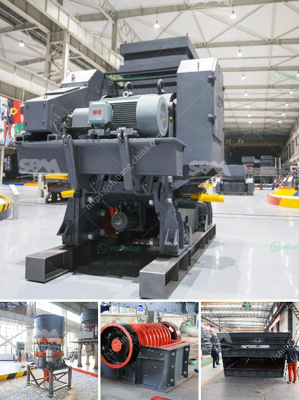

<h3>price of conveyor belts for mining</h3>
The mining industry heavily relies on conveyor belts for transporting materials and goods throughout the mining process. These belts are vital for enhancing productivity and efficiency, ensuring smooth operations, and reducing manual labor. However, the price of conveyor belts for mining can vary significantly depending on various factors. In this article, we will delve into the factors that impact the price range of conveyor belts for mining.

One of the primary factors affecting the price of conveyor belts is their durability and longevity. Mining operations typically involve harsh environments, such as extreme temperatures, abrasive materials, and heavy loads. Therefore, conveyor belts for mining need to be constructed with materials that can endure these conditions. Belts made from robust materials like steel or rubber with reinforcement layers tend to be more expensive but offer higher durability and longer lifespan, reducing the need for frequent replacements.

Additionally, the size, length, and width of conveyor belts impact their price. Mining operations often require long conveyor systems to transport materials over extended distances. Consequently, longer belts with greater width incur higher costs due to the additional materials used and the complexity of the manufacturing process.

The complexity of conveyor belt technology can also affect pricing. Advanced technologies, such as self-aligning systems or conveyor belt monitoring, contribute to safer and more efficient operations. However, these features may increase the price of the belts due to the inclusion of intricate sensors, automatic controls, or specialized components.

Moreover, the type of application in the mining industry can influence the price range. Conveyor belts can be tailored for specific mining tasks, such as transporting coal, ore, or minerals. The specific requirements of each application, such as resistance to fire, oil, or chemicals, will affect the cost of the belts. For example, belts designed for underground coal mines need to meet certain safety regulations and certifications, making them more expensive than belts used in surface mining operations.

The brand reputation and quality of the manufacturer also play a significant role in determining the price of conveyor belts for mining. Reputable manufacturers often have extensive experience in designing and producing durable and reliable conveyor belts. Although their prices might be higher compared to lesser-known alternatives, the guarantee of quality and performance makes them a more cost-effective choice in the long run.

Finally, the overall demand and supply in the market can affect the price of conveyor belts for mining. Fluctuations in commodity prices or changes in mining regulations can impact the demand for conveyor belts, leading to price variations. In times of high demand, conveyor belt manufacturers may raise their prices or experience supply chain disruptions, affecting the final price the customer pays.

In conclusion, the price of conveyor belts for mining depends on several factors. These include the durability and longevity of the belts, their size and complexity, the specific application, the reputation of the manufacturer, and market demand. While it's important to consider the cost of conveyor belts, mining companies should also take into account their quality and performance to ensure efficient and safe operations in the long term.
<h3>Contact us</h3><ul><li><strong>Whatsapp:&nbsp;<a href="https://wa.me/8613661969651">+8613661969651</a></strong></li><li><a href="https://swt.shibang-china.com/?git&amp;zhl&amp;price of conveyor belts for mining"><strong>Online Service(chat now)</strong></a></li></ul><h3>Related</h3><ul><li><a href='ball mill ball feeders.md'>ball mill ball feeders</a></li><li><a href='copper ore conveying system.md'>copper ore conveying system</a></li><li><a href='germany gypsum board manufacturing equipment.md'>germany gypsum board manufacturing equipment</a></li><li><a href='lum vertical mill.md'>lum vertical mill</a></li><li><a href='how is granite mined and processed.md'>how is granite mined and processed</a></li></ul>