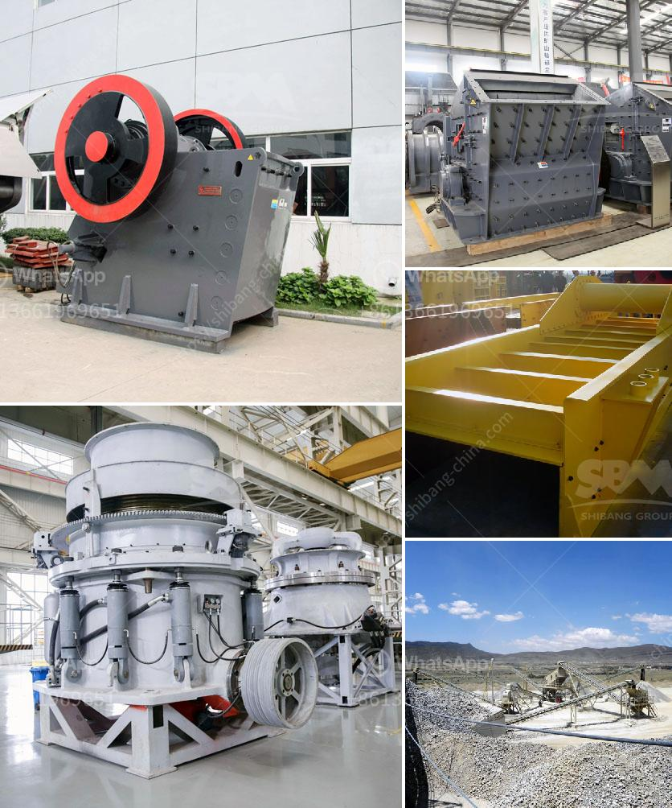

<h3>price of copper ore crushing machine</h3>
Copper is a widely used metal in various industries, including construction, electrical, and automotive. As a result, the demand for copper ore, the primary source of copper, remains consistently high. However, extracting copper from its ore requires a complex process that involves crushing the ore into smaller pieces. This crucial step requires the use of specialized machines designed for copper ore crushing. In this article, we will delve into the price factors that affect the purchase of these machines.

One of the essential factors influencing the price of copper ore crushing machines is the technical specification. Machine manufacturers provide various models with different capacities, power requirements, and efficiency levels. Machines with higher capacities or better efficiency often come at higher price points. Therefore, buyers should consider their specific needs and production requirements before investing in a copper ore crushing machine.

Another determinant of the price is the quality and durability of the machine. Copper ore crushing machines are subjected to high levels of mechanical stress due to the nature of the crushing process. This stress can lead to wear and tear on the machine over time. Machines constructed with high-quality materials and robust designs are generally more expensive but offer longer service life and reduced maintenance costs. Therefore, investing in a durable and reliable machine can result in long-term savings.

Additionally, the brand reputation and after-sales service also contribute to the price of copper ore crushing machines. Established brands with a proven track record often charge a premium for their products. However, these brands often provide excellent customer support, timely maintenance services, and reliable warranties. Choosing a reputable brand ensures peace of mind and minimizes the risk of unexpected breakdowns, ultimately leading to better overall value.

The availability and sourcing of raw materials needed for manufacturing these machines is another factor impacting the price. Copper ore crushing machines typically require specific components and materials, such as steel, electrical components, and crushing surfaces. Fluctuations in raw material prices, especially for metals like steel, can affect the final cost of the machine. Additionally, factors like transportation costs and import/export duties also play a role in setting the price. Monitoring and anticipating changes in raw material costs can help buyers make informed decisions.

Market demand and competition also influence the price of copper ore crushing machines. If there is a high demand for these machines, manufacturers may increase prices to maximize profits. On the other hand, increased competition can lead to price reductions as manufacturers strive to attract more buyers. Keeping an eye on market trends and comparing prices from different suppliers can help buyers find the best deal.

In conclusion, the price of copper ore crushing machines is influenced by numerous factors. Technical specifications, quality and durability, brand reputation, raw material costs, and market demand all play a role in determining the final price. Buyers must carefully consider these factors to make an informed investment decision. By choosing the right machine at the right price, buyers can maximize their productivity and profitability in the copper industry.
<h3>Contact us</h3><ul><li><strong>Whatsapp:&nbsp;<a href="https://wa.me/8613661969651">+8613661969651</a></strong></li><li><a href="https://swt.shibang-china.com/?git&amp;zhl&amp;price of copper ore crushing machine"><strong>Online Service(chat now)</strong></a></li></ul><h3>Related</h3><ul><li><a href='grinding unit cement plant south africa.md'>grinding unit cement plant south africa</a></li><li><a href='gypsum granules machine in india.md'>gypsum granules machine in india</a></li><li><a href='copper ore crushing machinery.md'>copper ore crushing machinery</a></li><li><a href='prices of copper smelting plant.md'>prices of copper smelting plant</a></li><li><a href='grinding mills for sale johannesburg.md'>grinding mills for sale johannesburg</a></li></ul>