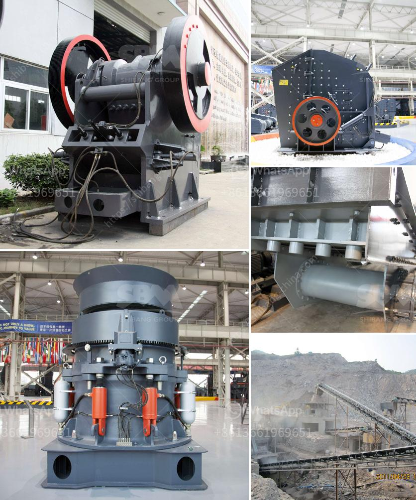

<h3>price of crusher machine for sale in nigeria</h3>
The price of crusher machine in Nigeria provides investors with abundant returns. Crusher machines are indispensable for processing various stones and ores. They are widely utilized in sectors such as mining, construction, metallurgy, and even in the waste recycling industry. The applications of crushers are numerous and they have become the primary equipment used for crushing stones into smaller sizes for further processing.

Nigeria, as a developing country, has a huge market for crusher machines. With a growing population, there is an increasing demand for stones from quarries and mines. This has resulted in the need for more advanced crushing equipment to facilitate efficient production. In order to meet this demand, many manufacturers of crusher machines have emerged in Nigeria, offering various models and specifications.

When considering the price of crusher machines in Nigeria, one must consider the quality and durability of the machine. The cost of a crusher machine should be within one's budget and it should be durable enough to withstand daily use. It is advisable to purchase crusher machines from reputable manufacturers who offer warranties and after-sales support. This ensures that the machine will be repaired or replaced in case of any malfunctions.

Another factor that affects the price of crusher machines in Nigeria is the type of machine. Different types of crusher machines have different characteristics and prices. Some machines are known for their high production capacity, while others are more compact and portable. The type of machine that suits one's needs and preferences should be considered when purchasing a crusher machine.

In addition, the size and weight of the machine also affect its price. Larger and heavier crusher machines are usually more expensive, as they require more materials and resources for production. However, they may also offer higher production capacity and be more suitable for large-scale operations. On the other hand, smaller and lighter machines may be cheaper, but they may have lower production capacity and may not be suitable for heavy-duty use.

The availability of spare parts and maintenance services also influences the price of crusher machines in Nigeria. Machines that have readily available spare parts and easy maintenance procedures are generally more expensive. This is because maintenance and repairs will be easier and quicker, ensuring minimal downtime and increased productivity.

Lastly, market demand and competition among manufacturers also play a role in determining the price of crusher machines. If the demand for crusher machines is high and there are multiple manufacturers in the market, prices may be more competitive. Conversely, if the demand is low and there are only a few manufacturers, prices may be higher due to limited supply.

In conclusion, the price of crusher machines in Nigeria depends on various factors such as the quality, type, size, weight, availability of spare parts, maintenance services, and market demand. It is important for buyers to consider these factors and conduct thorough research before making a purchase. By doing so, they can ensure that they are getting a high-quality machine at a reasonable price. With the growth of Nigeria's economy and the increasing demand for stones, investing in a crusher machine can be a profitable venture.
<h3>Contact us</h3><ul><li><strong>Whatsapp:&nbsp;<a href="https://wa.me/8613661969651">+8613661969651</a></strong></li><li><a href="https://swt.shibang-china.com/?git&amp;zhl&amp;price of crusher machine for sale in nigeria"><strong>Online Service(chat now)</strong></a></li></ul><h3>Related</h3><ul><li><a href='mill grinding machines for sale.md'>mill grinding machines for sale</a></li><li><a href='philippines kenya stone crusher.md'>philippines kenya stone crusher</a></li><li><a href='mobile crusher supplier.md'>mobile crusher supplier</a></li><li><a href='coarse powder grinding mill.md'>coarse powder grinding mill</a></li><li><a href='consol glass recycling price list south africa.md'>consol glass recycling price list south africa</a></li></ul>