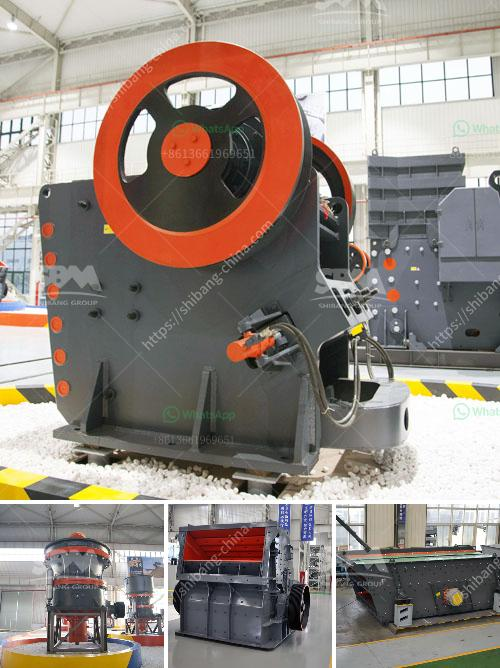

<h3>price of grinding machine in india</h3>
The advancement in technology has led to the development of various machines to ease human life. One such machine is the grinding machine, which is widely used in various industries for grinding materials into smaller sizes. In India, there are numerous grinding machine manufacturers offering a wide range of grinding machines at competitive prices.

The price of a grinding machine depends on the specifications of the machine and the materials it processes. The price varies from tens of thousands to hundreds of thousands of Indian rupees. The cost also varies based on the brand, warranty, and service requirements.

One of the leading manufacturers of grinding machines in India is HMT Machine Tools Limited (HMT). Established in 1953, HMT has a long history of producing quality grinding machines. The prices of their machines range from around INR 9.8 lakhs to INR 13.9 lakhs, depending on the model and specifications.

Another prominent manufacturer in India is Bharat Heavy Electricals Limited (BHEL). BHEL produces grinding machines for a wide range of industries, including power, steel, and cement. Their prices range from around INR 7.9 lakhs to INR 11.5 lakhs.

TOS Universal Cylindrical Grinding Machines is yet another popular brand in India. They offer grinding machines with different specifications to cater to various industrial needs. The price of their machines ranges from around INR 4.3 lakhs to INR 10.4 lakhs.

Apart from the well-established manufacturers, there are also local manufacturers in India who offer grinding machines at competitive prices. These local manufacturers produce machines that meet the industry standards and requirements. The prices of their machines can range from as low as INR 2 lakhs to upwards of INR 7 lakhs.

It is essential to note that the price of a grinding machine is not the only factor to consider when making a purchase. Other factors to consider include the quality of the machine, post-sales service, and availability of spare parts. It is crucial to choose a machine that offers a balance between price and quality to ensure long-term efficiency and durability.

Moreover, it is advisable to compare prices from different manufacturers before making a final decision. This allows the buyer to get the best value for their money and ensure that they are making a wise investment.

In conclusion, the price of a grinding machine in India varies depending on the specifications, brand, warranty, and service requirements. The prices can range from tens of thousands to hundreds of thousands of Indian rupees. It is essential to choose a machine that offers a balance between price and quality to ensure long-term efficiency and durability. Comparing prices from different manufacturers is also advisable to get the best value for money.
<h3>Contact us</h3><ul><li><strong>Whatsapp:&nbsp;<a href="https://wa.me/8613661969651">+8613661969651</a></strong></li><li><a href="https://swt.shibang-china.com/?git&amp;zhl&amp;price of grinding machine in india"><strong>Online Service(chat now)</strong></a></li></ul><h3>Related</h3><ul><li><a href='price of conveyor belts for mining.md'>price of conveyor belts for mining</a></li><li><a href='quarry crusher equipment for sale.md'>quarry crusher equipment for sale</a></li><li><a href='crushing plant layout.md'>crushing plant layout</a></li><li><a href='used crusher for sale in tanzania.md'>used crusher for sale in tanzania</a></li><li><a href='iron ore dry grinding systems.md'>iron ore dry grinding systems</a></li></ul>