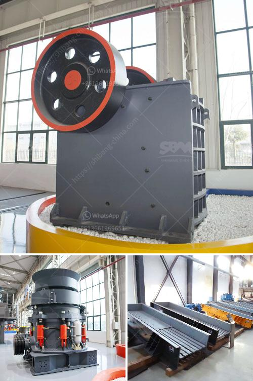

<h3>price of medium quarry plant</h3>
The price of a medium-sized quarry plant can vary depending on several factors. These factors include the type of equipment, capacity, production requirements, and location, among others. 

A medium-sized quarry plant typically includes various types of crushers, screens, conveyors, feeders, and other equipment necessary for the production of aggregates or other materials. The price of these equipment can range from several thousand dollars to several million dollars, depending on their quality and specifications.

The capacity of the quarry plant also plays a crucial role in determining its price. A plant with a higher capacity, capable of producing a larger quantity of materials per hour, will generally have a higher price compared to a plant with a lower capacity.

Production requirements also influence the price as specific equipment may be required to meet certain specifications or quality standards. For example, if the quarry plant needs to produce a specific type of aggregate with precise particle size distribution, specialized crushers or screeners may be required, which can affect the overall cost.

The location of the quarry plant can also impact its price. Shipping and transportation costs can be significant, especially if the plant needs to be transported over long distances or to remote areas. Additionally, labor and energy costs can vary depending on the location, affecting the operational expenses of the plant.

In conclusion, the price of a medium-sized quarry plant can vary significantly depending on multiple factors. It is crucial for potential buyers to thoroughly evaluate their requirements and conduct market research to understand the average prices in the industry. Requesting quotes from different suppliers or consulting with experts can also help in decision-making and negotiating the best price for a medium-sized quarry plant.
<h3>Contact us</h3><ul><li><strong>Whatsapp:&nbsp;<a href="https://wa.me/8613661969651">+8613661969651</a></strong></li><li><a href="https://swt.shibang-china.com/?git&amp;zhl&amp;price of medium quarry plant"><strong>Online Service(chat now)</strong></a></li></ul><h3>Related</h3><ul><li><a href='stone crushing machines south africa.md'>stone crushing machines south africa</a></li><li><a href='quarry equipment for sale in south africa.md'>quarry equipment for sale in south africa</a></li><li><a href='limestone jaw crushers.md'>limestone jaw crushers</a></li><li><a href='artificial sand making from sandstone.md'>artificial sand making from sandstone</a></li><li><a href='mobile screening and crushing.md'>mobile screening and crushing</a></li></ul>