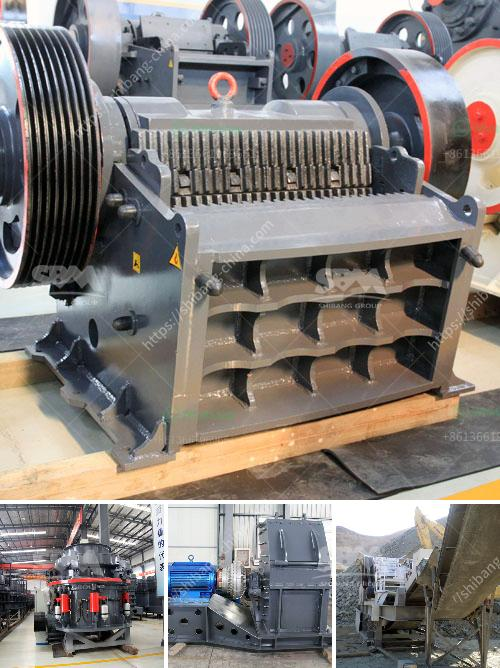

<h3>price of mobile stone crusher</h3>
The mobile stone crusher is a machine that often wears high-strength grinding, but if it does not do well before the use of the mobile stone crusher, it will affect the production and, in serious cases, the mobile crusher Damaged, causing serious safety accidents. Therefore, in the operation process, it is necessary to pay attention to the attentiveness of the equipment and to the maintenance of the equipment.

What is the price of mobile stone crusher? Different manufacturers will provide users with different prices. The chamber type of mobile stone crusher is determined by the corresponding mobile stone crusher model. When purchasing a mobile stone crusher, the customer can choose a suitable crusher type according to the required output of the crushing line. Mobile stone crusher production line configuration includes vibrating feeder, jaw crusher, impact crusher, cone crusher, vibrating screen, belt conveyor, etc.

According to the research needs of our customers, Zenith Heavy Industry recommended the mobile crushing station for them. This device is based on the customer's actual production requirements on-site to configure the material crushing equipment, which eliminates the customer's transportation costs and greatly improves the efficiency. In terms of efficiency, it is also above the average level and provides low consumption, low noise, and easy maintenance. It is the best choice for environmentally friendly high-grade stone crushing.

As a regular equipment for various production lines, it is widely used in all walks of life. For example, in the disposal and treatment of construction waste, the mobile stone crusher can be used to crush materials and produce sand and gravel aggregate, which is environmentally friendly and efficient. In addition, the device can also be used for crushing various ores and rocks and slag materials. As a professional manufacturer of mobile stone crushers, Zenith Heavy Industry has a perfect set of pre-sales and after-sales service systems, providing customers with comprehensive product solutions.

In terms of the price of the mobile stone crusher, there are many factors that affect the price of the product. Different manufacturers will have different quotation methods. For example, the mobile crusher for construction waste recycling has a high production capacity of 30-800 tons per hour, and the output size may range from 0-5mm, 5-10mm, 10-20mm, 20-40mm, 40-80mm, etc. In addition, the production line for fine crushing construction waste includes vibrating feeder, jaw crusher, cone crusher, impact crusher, belt conveyor, circular vibrating screen, etc., so different configurations require different price.

Moreover, different manufacturers, equipment configuration and model, after-sales service, etc., will all affect the price of the mobile stone crusher. There are also various auxiliary equipment items, such as control cabinets, pneumatic valves, lubrication systems, etc., which will affect the price. Therefore, when purchasing, it is necessary to comprehensively consider various factors and choose the most cost-effective equipment that meets the needs of the production line.

To sum up, the price of mobile stone crusher varies greatly due to various factors. The materials, configuration, and models have a significant impact on the price. Before purchasing, you must make a detailed market survey and consult multiple suppliers, compare their prices, and choose the best manufacturer with a good reputation and a reasonable price. Only in this way can you buy a high-quality mobile stone crusher with guaranteed after-sales service.
<h3>Contact us</h3><ul><li><strong>Whatsapp:&nbsp;<a href="https://wa.me/8613661969651">+8613661969651</a></strong></li><li><a href="https://swt.shibang-china.com/?git&amp;zhl&amp;price of mobile stone crusher"><strong>Online Service(chat now)</strong></a></li></ul><h3>Related</h3><ul><li><a href='crusher jagged roller crusher plate.md'>crusher jagged roller crusher plate</a></li><li><a href='jaw crusher diagram.md'>jaw crusher diagram</a></li><li><a href='crusher supplier in saudi arabia.md'>crusher supplier in saudi arabia</a></li><li><a href='ultra fine milling machines.md'>ultra fine milling machines</a></li><li><a href='used rock crusher europe.md'>used rock crusher europe</a></li></ul>