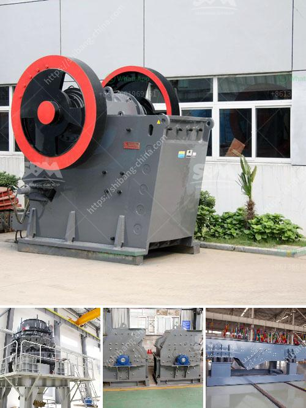

<h3>price of quarry crusher in zambia</h3>
Zambia is rich in mineral resources. If you do not have a deep understanding of the local mineral resources, then you might be at a loss of what mining machinery to buy. In today's article, we will talk about the price of quarry crusher in Zambia.

As a leading manufacturer and supplier of mining machinery, we understand that the price of quarry crusher in Zambia is closely related to the output, capacity, type and specifications of the equipment. In general, the higher the output and capacity, the higher the price will be. The type and specifications of the equipment will also affect the price, as different types of crushers have different processing capabilities.

In addition, the price of quarry crusher in Zambia is also influenced by the cost of raw materials, logistics, and transportation. As such, the distance between the quarry and the construction site plays a significant role in determining the price. The transportation and handling costs associated with moving the equipment from the quarry to the construction site can be substantial, leading to higher prices.

Another factor that affects the price of quarry crusher in Zambia is the demand for the product. If there is a high demand for the product in the market, the price is likely to be higher. On the other hand, if there is a low demand, the price may be lower. Therefore, it is important to consider the market demand when determining the price.

Furthermore, the price of quarry crusher in Zambia may also be influenced by government policies. Government regulations and taxes can affect the cost of mining and quarrying activities, which in turn can impact the price of quarry crusher. It is important for mining companies and quarry owners to understand and comply with the local regulations in order to avoid unnecessary costs and penalties.

To conclude, the price of quarry crusher in Zambia is influenced by various factors including the output, capacity, type and specifications of the equipment, as well as the cost of raw materials, logistics, transportation, market demand, and government policies. Therefore, it is important for buyers to consider these factors when purchasing quarry crusher equipment. By doing so, they can make an informed decision and ensure that they are getting the best value for their money.

In summary, understanding the price of quarry crusher in Zambia requires a comprehensive analysis of various factors. By taking into account the output, capacity, type and specifications of the equipment, as well as the cost of raw materials, logistics, transportation, market demand, and government policies, buyers can determine the most suitable and cost-effective solution for their specific needs.
<h3>Contact us</h3><ul><li><strong>Whatsapp:&nbsp;<a href="https://wa.me/8613661969651">+8613661969651</a></strong></li><li><a href="https://swt.shibang-china.com/?git&amp;zhl&amp;price of quarry crusher in zambia"><strong>Online Service(chat now)</strong></a></li></ul><h3>Related</h3><ul><li><a href='malaysia quarry crusher peninsula.md'>malaysia quarry crusher peninsula</a></li><li><a href='used cement mills for sale in india.md'>used cement mills for sale in india</a></li><li><a href='slag processing plant in india.md'>slag processing plant in india</a></li><li><a href='suppliers of mining equipment in south africa.md'>suppliers of mining equipment in south africa</a></li><li><a href='stone crusher equipment quarry.md'>stone crusher equipment quarry</a></li></ul>