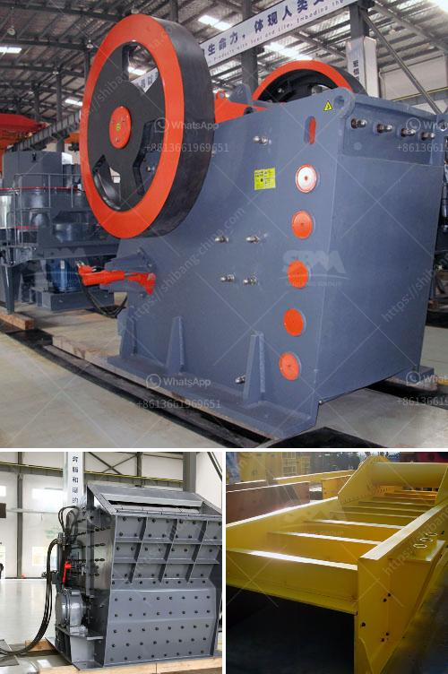

<h3>price of stone crusher</h3>
In recent years, the rapid growth of the construction industry has raised a high demand for crushers all over the world. More and more contractors are investing in a stone crusher due to its high productivity and high return on investment. It is essential to choose the right crusher for your business needs.

Moreover, the price of stone crusher may be affected by the local economy and other factors. The cost of stone crusher varies greatly depending on the following factors:

Jaw crushers have different capacity and different fineness of the finished products. The common capacity is 50t / h, 100 t / h, 150 t / h 200 t / h, and 300 to 400 t / h. The usual fine is 20 to 50 mm. Secondary crushing limestone. After primary crushing, use the impact crusher for secondary crushing. Impact Crusher is also the stone crushing machine used in common limestone quarry. It has the functions of grinding and training, can make very good cubic shape.

2. Another factor affecting the price of stone crusher is the capacity you need. Different capacities require different models of crushers. Different crushers have different sizes of feed inlet, which means that the amount of material that can be processed per unit time is different. The cost of the crusher with high throughput is higher than that of the crusher with low throughput.

Market competition is one of the factors affecting the price of crushers. In the market, there are both high-priced crushers and low-priced crushers. Common stone crusher Withtph capacity Is expensive because of the high price of raw materials and labor costs. Some of these come from some countries, where the wages of workers are much higher. Therefore, an expensive crusher equipment outsourcing company will have higher hardware configuration and have higher production costs, which will increase the price of equipments.

In order to ensure the production capacity and quality of stone crusher, manufacturers usually purchase a large number of accessories and wear parts. This requires manufacturers to invest a lot of money, labor costs and other costs. Therefore, these additional costs will increase the price of the crusher.

The price of a crusher is undoubtedly an important factor for customers. However, price should not be the only reason to buy the crusher. Quality should also be taken into consideration. Good quality equipment can be more durable and wear-resistant, reducing maintenance costs and ensuring greater profits.

In conclusion, considering the variety of factors, it is worthy to buy a crusher with high quality and low price. Since the cost of stone crusher depends on the type and model of the crusher, it is advisable to first conduct a market survey and then select the most cost-effective machine.
<h3>Contact us</h3><ul><li><strong>Whatsapp:&nbsp;<a href="https://wa.me/8613661969651">+8613661969651</a></strong></li><li><a href="https://swt.shibang-china.com/?git&amp;zhl&amp;price of stone crusher"><strong>Online Service(chat now)</strong></a></li></ul><h3>Related</h3><ul><li><a href='gold milling machine for small scale production germany.md'>gold milling machine for small scale production germany</a></li><li><a href='pf series impact crusher.md'>pf series impact crusher</a></li><li><a href='crusher machine price in saudi.md'>crusher machine price in saudi</a></li><li><a href='ultra fine dry grinding mill.md'>ultra fine dry grinding mill</a></li><li><a href='copper slag manufacturing process.md'>copper slag manufacturing process</a></li></ul>