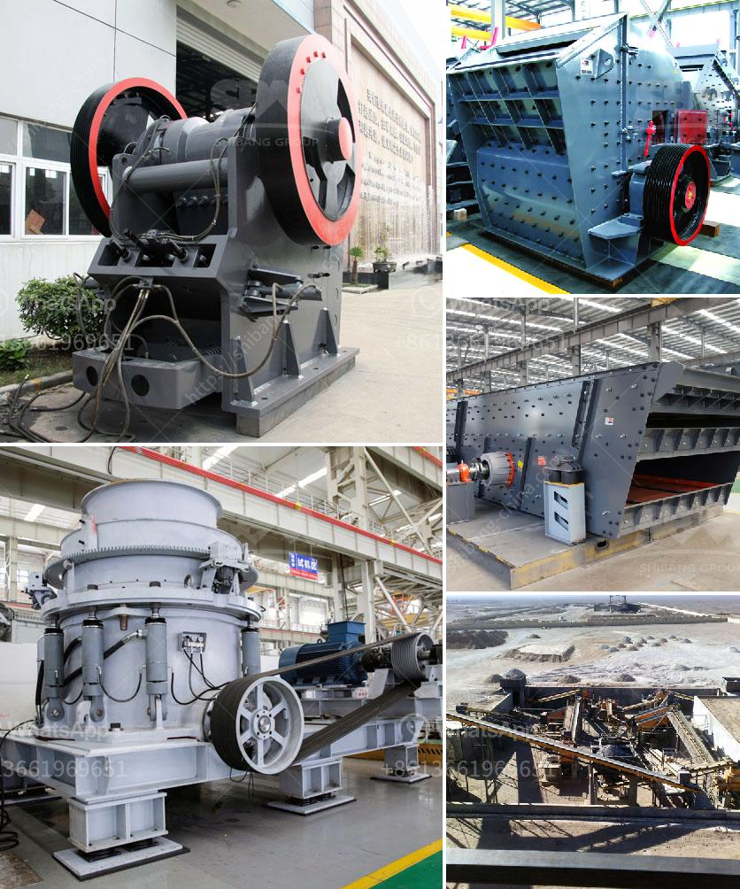

<h3>price of world largest stone crushing plant</h3>
The world's largest stone crushing plant is the massive installation of various machines, such as crushers, screens, and conveyor belts, operated by a diversified range of workers, including skilled and unskilled workers at a single location for uninterrupted operation, day and night. This plant represents an investment in the millions of dollars range, as it requires high-quality equipment to crush and process stones efficiently.

Starting with the primary crusher, the most expensive machinery in the plant, it is essential to choose the right type and size to accommodate the stones' physical properties. Jaw crushers are commonly used as primary crushers due to their durability and high efficiency. They are capable of crushing large rocks of up to 3 feet in diameter into smaller sizes suitable for further processing.

Screens play a crucial role in separating the crushed stones into different sizes for various applications. Vibrating screens are commonly employed, allowing precise classification based on size. The cost of screens depends on their size, specifications, and quality.

Conveyor belts are indispensable in transporting the crushed stones from one processing stage to another. They help in reducing manual labor and ensure continuous and efficient operation. The cost of conveyor belts depends on their length, width, capacity, and material.

Taking into consideration all the necessary equipment and machinery, the overall cost of the world's largest stone crushing plant can range from millions to hundreds of millions of dollars. To maximize productivity and minimize downtime, regular maintenance and replacement of worn-out parts are crucial, adding to the overall operational cost.

Moreover, other factors, such as location, transportation, labor, and electricity costs, should be considered for an accurate estimation of the total investment. Additionally, regulatory requirements and environmental considerations may further influence the overall price.

In conclusion, the price of the world's largest stone crushing plant can be a significant investment due to the high-quality machinery and equipment required for efficient operation. Proper planning, careful selection, and regular maintenance are vital to ensure long-term profitability and productivity.
<h3>Contact us</h3><ul><li><strong>Whatsapp:&nbsp;<a href="https://wa.me/8613661969651">+8613661969651</a></strong></li><li><a href="https://swt.shibang-china.com/?git&amp;zhl&amp;price of world largest stone crushing plant"><strong>Online Service(chat now)</strong></a></li></ul><h3>Related</h3><ul><li><a href='bauxite processing plant project cost.md'>bauxite processing plant project cost</a></li><li><a href='crush rock industries nigeria.md'>crush rock industries nigeria</a></li><li><a href='aggregate vibrating screens.md'>aggregate vibrating screens</a></li><li><a href='the process of limestone.md'>the process of limestone</a></li><li><a href='part of ball mills.md'>part of ball mills</a></li></ul>