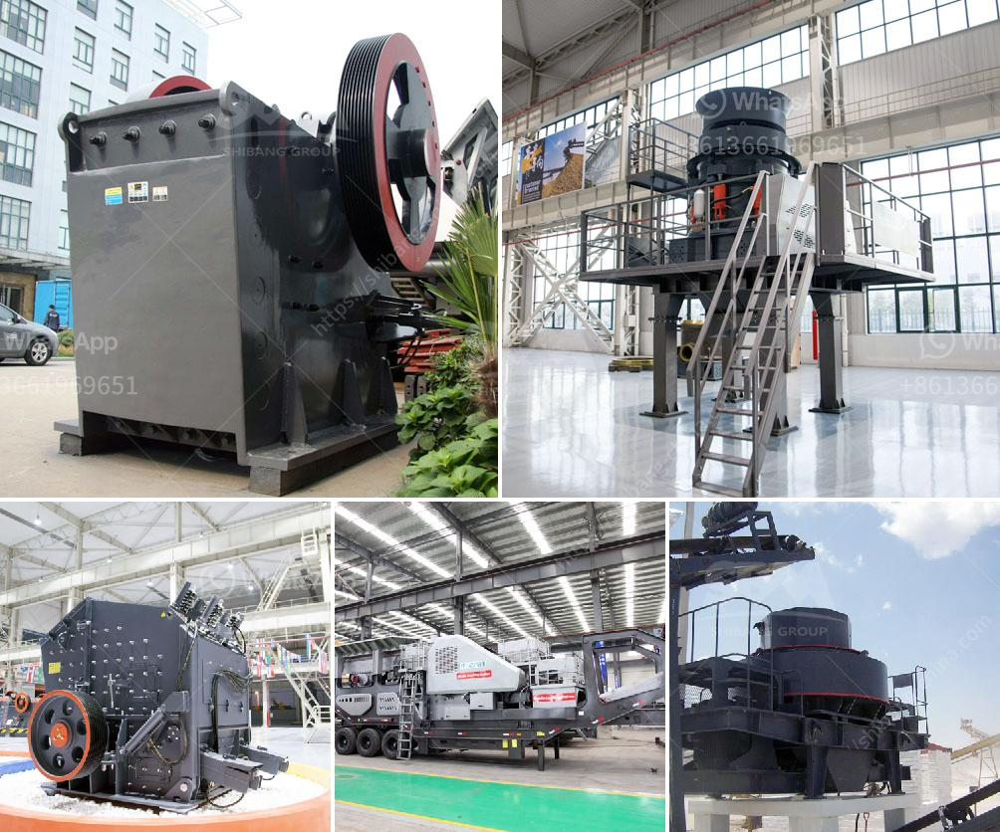

<h3>price of zenith mining</h3>
Zenith Mining is a well-known and respected player in the mining industry, offering a wide range of products and services to support the extraction of minerals from the earth. With its state-of-the-art technologies and industry expertise, Zenith Mining has garnered a reputation for delivering robust and reliable mining solutions. However, the question arises: what is the price of availing these services?

When it comes to the price of Zenith Mining, it is important to consider several factors. Firstly, the specific product or service required by the customer plays a crucial role in determining the cost. Zenith Mining offers a multitude of offerings, ranging from mining equipment, such as crushers and screens, to comprehensive mining operations and maintenance services. This wide range of services allows customers to select what aligns with their needs, whether it be a one-time equipment purchase or a long-term mining operation contract.

Additionally, the scale and complexity of the project also influence the price. Factors such as the size of the operation, depth of the mine, location, and geological conditions can all impact the cost. These variables need to be carefully analyzed and evaluated to determine an accurate quote.

Furthermore, it is essential to mention that while the price of Zenith Mining may seem initially hefty, it represents a worthy investment. Zenith Mining constantly invests in research and development to enhance its technology and innovation, meaning customers benefit from cutting-edge solutions that increase efficiency, productivity, and safety. With a high-quality product or service, customers can expect long-term operational benefits and a solid return on investment.

To ensure transparency and customer satisfaction, Zenith Mining provides detailed cost breakdowns and tailored proposals according to each client's unique needs. This allows customers to fully understand the price structure and make informed decisions based on their budget and requirements.

Ultimately, the price of Zenith Mining is not merely a financial burden but rather an investment in superior quality, reliability, and efficiency. By availing their services, customers gain access to advanced technologies and expertise that accelerate their mining operations while minimizing risks. This, in turn, leads to increased profitability and overall success in the competitive mining industry.

In conclusion, the cost of Zenith Mining is well worth the investment. With its extensive range of products and services, state-of-the-art technology, and commitment to customer satisfaction, Zenith Mining offers exceptional value that ultimately translates into increased productivity and profitability for its clients.
<h3>Contact us</h3><ul><li><strong>Whatsapp:&nbsp;<a href="https://wa.me/8613661969651">+8613661969651</a></strong></li><li><a href="https://swt.shibang-china.com/?git&amp;zhl&amp;price of zenith mining"><strong>Online Service(chat now)</strong></a></li></ul><h3>Related</h3><ul><li><a href='marble quarry equipment.md'>marble quarry equipment</a></li><li><a href='calcium processing plant.md'>calcium processing plant</a></li><li><a href='feldspar ball mills feldspar ball mills manufacturers.md'>feldspar ball mills feldspar ball mills manufacturers</a></li><li><a href='stone crusher machine for sale kenya.md'>stone crusher machine for sale kenya</a></li><li><a href='stone crusher company india mastro.md'>stone crusher company india mastro</a></li></ul>