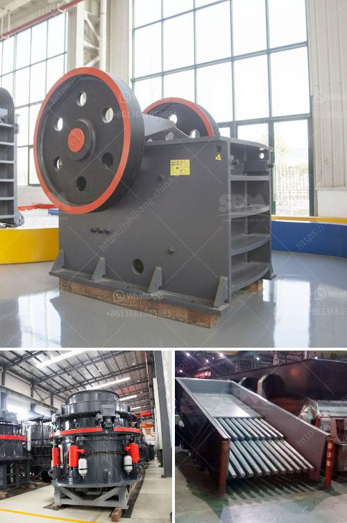

<h3>price rock crusher peru</h3>
In recent years, the mining industry in Peru has experienced tremendous growth, leading to an increase in the demand for heavy machinery and equipment. One such equipment that has gained significant popularity among mining professionals is the rock crusher. A rock crusher is a machine that is designed to break down large rocks into smaller pieces, making them easier to transport and work with.

When it comes to purchasing a rock crusher in Peru, it's crucial to consider the price. The price of a rock crusher can vary greatly depending on the specifications, features, and functionality of the machine. However, it's important not to compromise quality for a lower price. Investing in a high-quality rock crusher can save miners a significant amount of time, money, and resources in the long run.

One factor that affects the price of a rock crusher is the manufacturer. There are numerous manufacturers in the market, each offering different machinery at various price points. It is advisable to research and compare the prices, reputation, and customer reviews of different manufacturers before making a final decision.

Additionally, the type of rock crusher can influence its price. There are different types of rock crushers available, such as jaw crushers, cone crushers, impact crushers, and more. Each type caters to specific needs and requirements. While some machinery may have a higher price due to its advanced technology and capabilities, it may be essential for certain mining operations.

Furthermore, the capacity and production rate of the rock crusher can affect its price. A machine with a higher capacity and production rate may come at a higher price point. However, it can significantly increase productivity and efficiency in mining operations, leading to a higher return on investment.

In conclusion, when considering the price of a rock crusher in Peru, it is essential to prioritize quality, functionality, and capacity. Although price is a significant factor, it shouldn't be the sole determining factor. Investing in a high-quality rock crusher with a reasonable price can benefit mining professionals by increasing productivity and profitability in the long run. Thorough research and comparison of different manufacturers and types of rock crushers are highly recommended to make an informed decision.
<h3>Contact us</h3><ul><li><strong>Whatsapp:&nbsp;<a href="https://wa.me/8613661969651">+8613661969651</a></strong></li><li><a href="https://swt.shibang-china.com/?git&amp;zhl&amp;price rock crusher peru"><strong>Online Service(chat now)</strong></a></li></ul><h3>Related</h3><ul><li><a href='cost or operating stone quarry and crusher.md'>cost or operating stone quarry and crusher</a></li><li><a href='three ring micro powder mill.md'>three ring micro powder mill</a></li><li><a href='crushing media liner manufacturers.md'>crushing media liner manufacturers</a></li><li><a href='modular mineral processing plant.md'>modular mineral processing plant</a></li><li><a href='double jaw crusher.md'>double jaw crusher</a></li></ul>