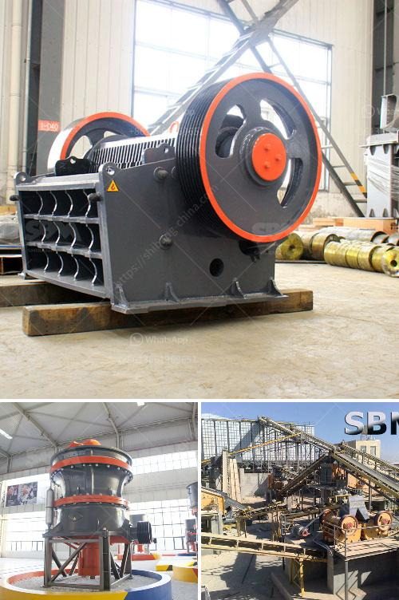

<h3>prices crusher prices gypsum crusher prices</h3>
Gypsum, a widely used mineral in various industries, requires processing into smaller particles before being used for different purposes. The gypsum crusher plays a crucial role in this process, and understanding its prices is key to optimizing cost-effective procurement strategies. This article will delve into the factors that influence gypsum crusher prices, helping buyers make informed decisions and strike the right balance between cost and quality.

The specifications of a gypsum crusher greatly impact its price. Crushers with higher processing capacities and more advanced features tend to be pricier. For instance, crushers capable of handling larger quantities of gypsum and producing finer output sizes will be costlier due to their enhanced capabilities.

The reputation and brand value of the manufacturer significantly impact the prices of gypsum crushers. Renowned brands often charge a premium due to their established credibility and consistent quality. However, it is important to consider customer reviews and feedback to ensure that the price-boosting reputation is justified.

Another crucial factor affecting gypsum crusher prices is the design and construction quality. Crushers made using superior materials, innovative technologies, and strict quality control processes tend to command higher prices due to their durability, longevity, and performance. Opting for robustly built crushers can prove economical in the long run, as they require fewer repairs and replacements.

Energy efficiency is gaining prominence, not only to reduce the carbon footprint but also as a cost-saving measure. Crushers designed to consume less power while delivering high performance are often priced higher. It is advisable to assess the energy savings offered by a gypsum crusher and evaluate the potential financial benefits against the initial cost.

The availability of comprehensive after-sales support, including maintenance, spare parts, and technical assistance, is a crucial consideration while evaluating gypsum crusher prices. Manufacturers offering extended warranties and adequate support mechanisms tend to charge higher prices, ensuring customer satisfaction throughout the equipment's life cycle.

Evaluate different manufacturers, brands, and price ranges available in the market. Comparing product features, quality, and reliability of manufacturers will enable you to make an informed decision rather than settling for the cheapest option.

Obtain quotations from several manufacturers to compare prices, warranties, and after-sales service offerings. This establishes a healthy competition among suppliers, driving prices downwards without compromising on quality.

Although purchasing a gypsum crusher at a lower price might seem tempting, it is vital to consider the long-term operational costs, including energy consumption, maintenance, and potential downtime. Opting for a higher-priced, energy-efficient crusher could save substantial amounts of money in the future.

Negotiating with suppliers can help strike a balance between quality and price. Demonstrate a strong purchasing power and explore the possibility of discounts or flexible payment terms.

Understanding the factors influencing gypsum crusher prices can pave the way for cost-effective procurement strategies. By considering equipment specifications, manufacturer reputation, construction quality, energy efficiency, and after-sales support, buyers can strike the right balance between price and quality. Relying on a comprehensive market analysis, seeking multiple quotations, assessing long-term cost savings, and leveraging negotiation power are strategies that buyers should adopt to make an informed purchase decision.
<h3>Contact us</h3><ul><li><strong>Whatsapp:&nbsp;<a href="https://wa.me/8613661969651">+8613661969651</a></strong></li><li><a href="https://swt.shibang-china.com/?git&amp;zhl&amp;prices crusher prices gypsum crusher prices"><strong>Online Service(chat now)</strong></a></li></ul><h3>Related</h3><ul><li><a href='clinker grinding unit for cement clinker in india.md'>clinker grinding unit for cement clinker in india</a></li><li><a href='gold refining equipment machine plant.md'>gold refining equipment machine plant</a></li><li><a href='crusher stone price south africa.md'>crusher stone price south africa</a></li><li><a href='clay ball mill machine browns.md'>clay ball mill machine browns</a></li><li><a href='cost of equipment used in mining lead ore.md'>cost of equipment used in mining lead ore</a></li></ul>