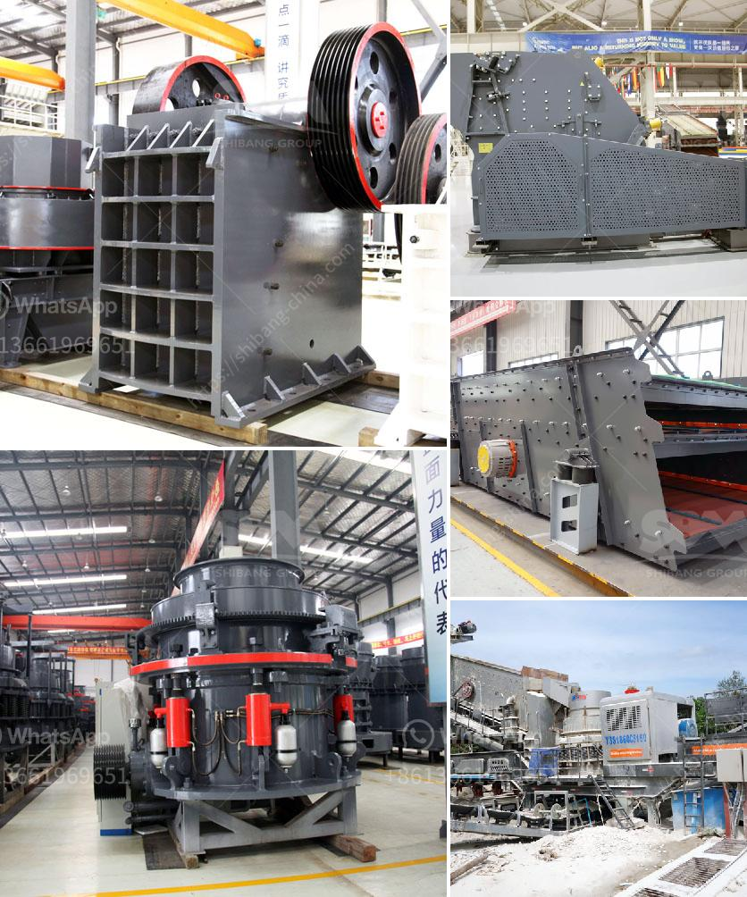

<h3>prices for stone crusher plant</h3>
Stone crusher plant is a profitable venture for new entrepreneurs. The demand for quality stone chips is increasing day by day. This is because the construction projects have been on a constant rise in recent times. The government has initiated various infrastructural development projects, which has resulted in a huge demand for stone aggregates. Consequently, the stone crusher plant has been on high demand.

As per a recent report by Market Research Future (MRFR), the Global Stone Crusher Market is expected to witness a steady growth with a CAGR of 6.1% during the forecast period from 2019-2025. Surprisingly, the stone crusher plant prices vary from as low as USD 10000 to as high as USD 500000.

Looking at the demand, analysis, and expected future market conditions, Stone Crushing Industry is expected to be a lucrative business. In order to run a successful crushing plant, an entrepreneur needs to have sufficient knowledge and expertise in this industry.

Stone crusher plant machinery depends on the feed size of the stone, the desired product size and the size of the crusher used. Following are the investment required for stone crusher plant.

To start with, it is important to have land for the plant. The entrepreneur needs to have a minimum area of one acre in order to set up the plant. This acreage will be required for stacking raw materials such as gravels, boulders, stone chips, and other materials.

The machinery and equipment required to set up a stone crushing plant include a primary crusher, a secondary crusher, a tertiary crusher, and associated equipment like vibrating screen and feeders. The plant mainly produces stone chips of various sizes, which are used as raw material for construction activities.

To obtain the desired consistency, crushing is done through three stages. The primary stage involves breaking down the stones to a manageable size. The secondary stage involves reducing the size further and the tertiary stage involves shaping the stones into desired sizes.

Stone crusher plants are available in two major types namely (a) stationary (b) portable or mobile. However, you can establish stationary crushers at quarry heads. Mainly, at the construction site, you can use the portable crushers.

The prices for different types of stone crushers are different, and the specific price can be consulted by the manufacturer. Therefore, the price of a stone crusher plant is related to the capacity and quality of the crushers.

In the market, there are various stone crusher machines, such as jaw crusher, counterattack crusher, vertical impact crusher, hydraulic cone crusher, hammer crusher, roll crusher, compound crusher, cone crusher, the two-stage crusher, gyratory crusher, mobile crusher and so on. These types of crusher machines have widely applications in stones processing plants and mineral crushing industries.

In conclusion, the stone crusher plant price varies depending on the models, types, and capacities. The mining industry is competitive in nature with increasing emphasis on quality, technological advancements, and innovative practices for producing energy-efficient and high-quality mining equipment. Potential investors should thoroughly evaluate this industry before making any investment decision. Overall, the stone crusher plant is a highly profitable venture for new entrepreneurs in the mining and construction industry.
<h3>Contact us</h3><ul><li><strong>Whatsapp:&nbsp;<a href="https://wa.me/8613661969651">+8613661969651</a></strong></li><li><a href="https://swt.shibang-china.com/?git&amp;zhl&amp;prices for stone crusher plant"><strong>Online Service(chat now)</strong></a></li></ul><h3>Related</h3><ul><li><a href='gold mining equipment pdf.md'>gold mining equipment pdf</a></li><li><a href='roll wheel pulverizer.md'>roll wheel pulverizer</a></li><li><a href='5 ton per hour mobile gold process mill.md'>5 ton per hour mobile gold process mill</a></li><li><a href='cement mill startup procedures.md'>cement mill startup procedures</a></li><li><a href='cost of lead zinc beneficiation plant.md'>cost of lead zinc beneficiation plant</a></li></ul>