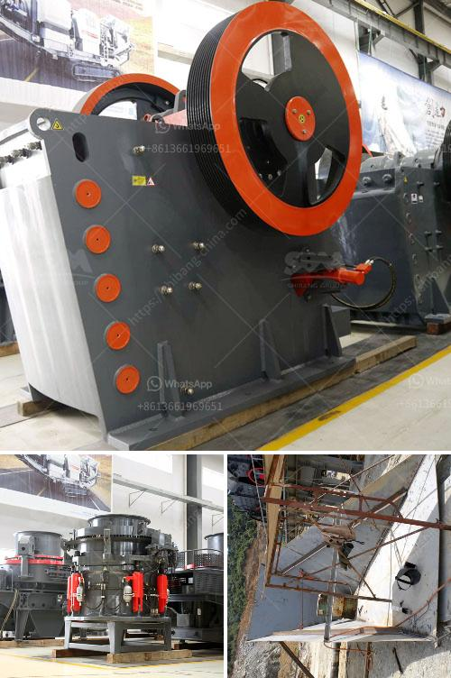

<h3>prices of copper smelting plant</h3>
Copper smelting plants play a crucial role in the mining industry as they are responsible for transforming raw copper ore into refined copper for various applications. The establishment of such plants requires careful consideration of several factors, with the cost being one of the most significant. In this article, we will delve into the prices of copper smelting plants and the factors that influence their costs.

The cost of a copper smelting plant can vary significantly depending on multiple variables. One of the primary factors is the plant's scale or capacity, as larger plants generally require more investment. A smelting plant with a capacity of 300 to 500 metric tons per day (MTPD) falls within the moderate range, and its prices typically range from $10 million to $50 million.

The location of the plant also plays a role in determining its cost. In areas with a high cost of living or where infrastructure is not well-developed, the price of establishing a copper smelting plant can be higher. Additionally, proximity to copper mines is crucial, as transportation costs can contribute significantly to the overall expenses.

Technological advancements and environmental regulations also impact the cost of copper smelting plants. Upgrading plants to utilize clean and efficient technologies can increase their prices. The cost of incorporating pollution control measures, such as scrubbers and waste treatment systems, needs to be considered as well.

Labor costs are another crucial aspect to consider. Skilled labor is required to operate and maintain a smelting plant safely and efficiently. Depending on the location and project requirements, wages can vary greatly, influencing the overall cost of the plant.

Furthermore, the prices of raw materials and equipment required for the construction of a copper smelting plant can fluctuate. Copper ore prices are subject to market conditions and can impact the overall investment. Additionally, equipment such as converters, furnaces, and electrolytic cells can vary in price depending on their quality, brand, and origin.

Other factors that can affect the cost of a smelting plant include permits and licenses, land acquisition, engineering and design services, project management, and contingency costs. It is essential to conduct thorough feasibility studies and cost estimations to ensure accurate budgeting and prevent any unforeseen expenses.

Investing in a copper smelting plant requires careful analysis and due diligence. Potential investors should assess the plant's capacity, location, technological requirements, labor costs, and fluctuating prices of raw materials and equipment. Engaging professionals with expertise in the field can help navigate the intricacies of establishing a copper smelting plant and provide accurate estimates of the overall cost.

In conclusion, the price of a copper smelting plant with a capacity of 300 to 500 MTPD can range from $10 million to $50 million. Several factors contribute to this cost, including plant capacity, location, technology, labor costs, raw material and equipment prices, among others. Thorough planning, feasibility studies, and professional guidance are key to ensuring an accurate estimation of investment requirements for establishing a successful copper smelting plant.
<h3>Contact us</h3><ul><li><strong>Whatsapp:&nbsp;<a href="https://wa.me/8613661969651">+8613661969651</a></strong></li><li><a href="https://swt.shibang-china.com/?git&amp;zhl&amp;prices of copper smelting plant"><strong>Online Service(chat now)</strong></a></li></ul><h3>Related</h3><ul><li><a href='stone crushing plant keesara.md'>stone crushing plant keesara</a></li><li><a href='gold mining mills in south africa.md'>gold mining mills in south africa</a></li><li><a href='marble crusher industry philippines.md'>marble crusher industry philippines</a></li><li><a href='stone crusher supplier company.md'>stone crusher supplier company</a></li><li><a href='stone crusher machine for sale in ethiopia.md'>stone crusher machine for sale in ethiopia</a></li></ul>