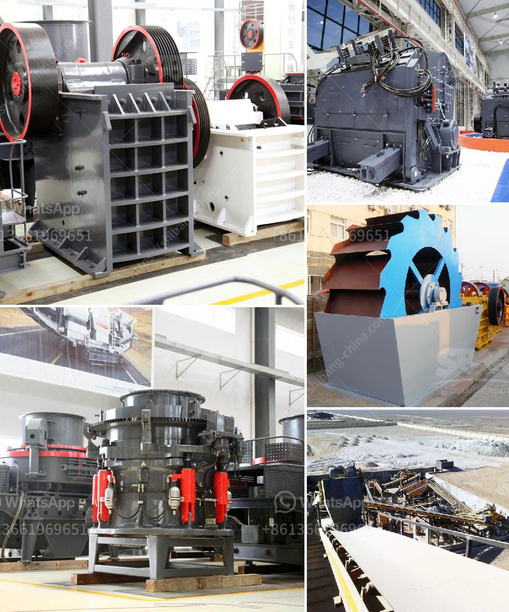

<h3>prices of stone crusher</h3>
The prices of stone crusher machines are related to various factors, such as brand and manufacturer, specification, model, and country of origin. The more factors affect the price, the more diverse the price range. The higher the price, the higher the purchasing power of users, the more expensive the machine, and the stronger the price movement. Conversely, the lower the price, the wider the market and the broader the range of buyers. 

Brand and Manufacturer: Different brands and manufacturers have different production technologies and levels of reputation. Well-known brands and manufacturers often have higher prices due to the higher quality and better after-sales service. However, some unknown or local brands may offer machines at lower prices to attract customers and build their brand awareness.

Specification and Model: Different stone crusher machines have different specifications and models. Machines with higher specifications and models are typically more expensive because they have more advanced technology, better performance, and higher productivity. Buyers can choose the appropriate specification and model according to their needs and budget.

Country of Origin: The country of origin is also a factor affecting the price of stone crusher machines. Machines from countries with a higher manufacturing level and production costs, such as developed countries, tend to have higher prices compared to machines produced in developing countries. This price difference is mainly due to differences in labor costs, raw material prices, and manufacturing technology.

In conclusion, the prices of stone crusher machines vary greatly depending on the brand and manufacturer, specification and model, and country of origin. Buyers should conduct detailed research and comparisons before making a purchase to find the right machine that meets their requirements at the most reasonable price.
<h3>Contact us</h3><ul><li><strong>Whatsapp:&nbsp;<a href="https://wa.me/8613661969651">+8613661969651</a></strong></li><li><a href="https://swt.shibang-china.com/?git&amp;zhl&amp;prices of stone crusher"><strong>Online Service(chat now)</strong></a></li></ul><h3>Related</h3><ul><li><a href='dolomite crushing plant.md'>dolomite crushing plant</a></li><li><a href='mining equipment tanzania.md'>mining equipment tanzania</a></li><li><a href='conveyor belts company.md'>conveyor belts company</a></li><li><a href='grinding mill for red oxide ore.md'>grinding mill for red oxide ore</a></li><li><a href='300ton per hour stone crusher.md'>300ton per hour stone crusher</a></li></ul>