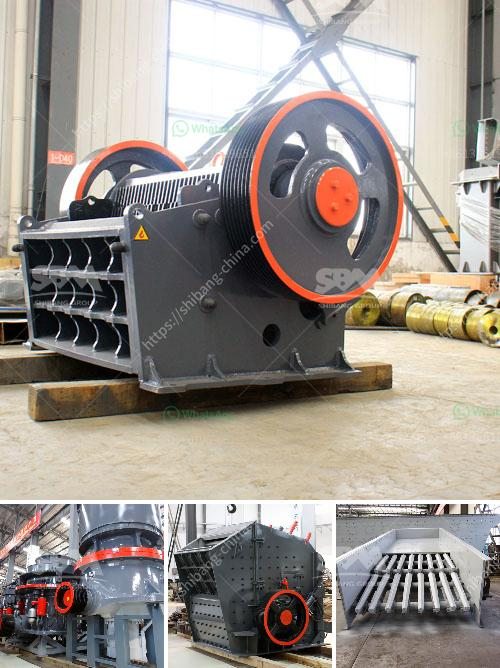

<h3>prices of stone crushers</h3>
When it comes to choosing a stone crusher, there are numerous factors that need to be considered, including production requirements, budget, and the degree of hardness of the material being crushed. To make an informed decision, it is essential to compare prices and analyze various options.

First, let's take a look at the key factors that affect the price of stone crushers. Different models, equipment specifications, production capacity, and even the manufacturer can all make a significant impact on the price tag. Generally, larger, more powerful models tend to cost more due to their increased production capacity and additional features.

Another crucial factor is the type of stone crusher being purchased. There are various types of crushers available on the market, each designed for different applications. Jaw crushers are primarily used for coarse crushing, while cone crushers and impact crushers are used for medium and fine crushing. The choice of the right crusher depends on the specific needs of the project.

Production requirements play a significant role in determining the price range of stone crushers. If the project requires a high capacity of crushed material, crushers with larger capacities will be needed, which typically come with a higher price tag. Additionally, if the project demands a specific particle size or shape, specialized crushers that can meet those requirements may cost more.

The degree of hardness of the material being crushed also affects the price of stone crushers. Harder materials such as granite or basalt require more robust crushers with higher power levels. Consequently, these crushers tend to be more expensive compared to those used for softer materials like limestone or sandstone.

Besides these factors, the brand and reputation of the manufacturer also play a significant role in pricing. Well-established companies with a long history of producing high-quality crushers tend to charge more for their products. However, investing in a reliable and reputable brand ensures durability, longevity, and a lower risk of breakdowns, ultimately saving money in the long run.

To get a better understanding of the price range for stone crushers, it is essential to compare prices from different manufacturers. Online platforms and local dealerships can provide information about various models and their prices. However, it is crucial to note that the lowest price does not necessarily mean the best value for money. It is always wise to consider factors such as after-sales service, warranty coverage, and availability of spare parts before making a decision solely based on price.

In conclusion, when it comes to purchasing a stone crusher, potential buyers should consider various factors, including production requirements, material hardness, and budget. Comparing prices from different manufacturers and analyzing the specific needs of the project can help make an informed decision. By doing so, individuals can ensure they are getting the best value for their investment and a crusher that meets their requirements and expectations.
<h3>Contact us</h3><ul><li><strong>Whatsapp:&nbsp;<a href="https://wa.me/8613661969651">+8613661969651</a></strong></li><li><a href="https://swt.shibang-china.com/?git&amp;zhl&amp;prices of stone crushers"><strong>Online Service(chat now)</strong></a></li></ul><h3>Related</h3><ul><li><a href='indian river sand grinding machine price.md'>indian river sand grinding machine price</a></li><li><a href='talcum powder philling machine.md'>talcum powder philling machine</a></li><li><a href='limestone crusher limestone crusher equipment.md'>limestone crusher limestone crusher equipment</a></li><li><a href='used cement crushers for sale.md'>used cement crushers for sale</a></li><li><a href='crusher machine south africa.md'>crusher machine south africa</a></li></ul>