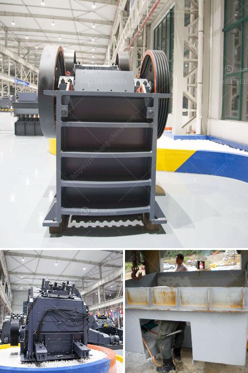

<h3>primary crusher price in bolivia</h3>
A primary crusher plays a pivotal role in the mining process, as it is responsible for reducing large-sized rocks into smaller, more manageable pieces. In Bolivia, a resource-rich country with a thriving mining industry, the primary crusher price holds significant importance for mining companies. This article delves into the various factors that impact the affordability of primary crushers in Bolivia and how businesses can make informed decisions when investing in this essential equipment.

The price of a primary crusher in Bolivia is closely linked to its specifications and capabilities. Investing in a crusher with higher capacity and efficiency will generally result in a higher price tag. With varying mining requirements and production targets, businesses must evaluate their needs carefully to strike an optimal balance between cost and performance.

Advancements in crusher technology and design have the potential to improve efficiency and reduce operational costs over time. While cutting-edge technologies come at a higher initial cost, the long-term savings realized through enhanced productivity, energy efficiency, and reduced maintenance can outweigh the initial investment. Businesses should consider the lifecycle cost of these modern crushers rather than merely focusing on upfront expenditure.

The primary crusher market in Bolivia is highly competitive, with numerous suppliers vying for market share. Supplier dynamics, competition, and market conditions greatly influence pricing fluctuations. By studying the market and comparing multiple quotes, mining companies can ascertain a fair market price for primary crushers. Additionally, building long-term relationships with reputable suppliers can lead to favorable pricing terms.

Purchasing a primary crusher involves more than just the initial price; it is essential to evaluate the total cost of ownership. Crushers with higher reliability and durability may come at a premium, but they often require less maintenance, leading to reduced operational costs in the long run. Furthermore, investing in training programs for operators and maintenance staff can optimize crusher performance and enhance efficiency.

Financing plays a crucial role in enabling businesses to acquire expensive mining equipment such as primary crushers. In Bolivia, various financing options, such as bank loans and leasing programs, are available to mining companies. Evaluating these options can help spread the cost over a more manageable timeframe and potentially mitigate the immediate strain on the company's finances.

Determining the primary crusher price in Bolivia involves considering multiple factors. Mining businesses should carefully analyze their production needs, evaluate the latest technological advancements, compare market prices, calculate the total cost of ownership, and explore flexible financing options. By meticulously assessing these factors, Bolivian mining companies can make informed decisions that align with their operational objectives, budget constraints, and long-term growth strategies.
<h3>Contact us</h3><ul><li><strong>Whatsapp:&nbsp;<a href="https://wa.me/8613661969651">+8613661969651</a></strong></li><li><a href="https://swt.shibang-china.com/?git&amp;zhl&amp;primary crusher price in bolivia"><strong>Online Service(chat now)</strong></a></li></ul><h3>Related</h3><ul><li><a href='crusher plants for sale in pakistan.md'>crusher plants for sale in pakistan</a></li><li><a href='talcum powder philling machine.md'>talcum powder philling machine</a></li><li><a href='dealers of mobile jaw crusher in kenya.md'>dealers of mobile jaw crusher in kenya</a></li><li><a href='crushed sand manufacturing.md'>crushed sand manufacturing</a></li><li><a href='m sand manufacturing process.md'>m sand manufacturing process</a></li></ul>