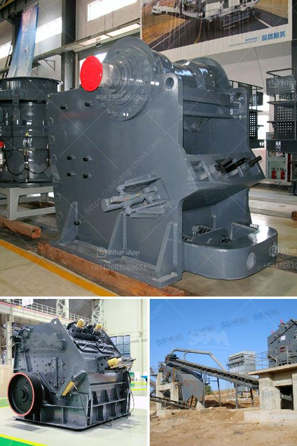

<h3>principle of jaw crusher operation</h3>
The principle of jaw crusher operation is that the movable jaw hangs on the mandrel and moves back and forth under the action of the eccentric shaft. When the movable jaw moves back and forth, the angle between the fixed jaw and the movable jaw becomes smaller, and the materials can be crushed. When the movable jaw rises, the angle between the toggle plate and the movable jaw becomes larger, which pushes the movable jaw plate to approach the fixed jaw plate. During the working process of jaw crusher, the machine adopts the hydraulic safety device, which can protect the machine in case that the jaw plate suddenly goes up.

Jaw crusher is applied in various sectors, such as mining, metallurgy, building materials, highway, railway, water conservancy and chemical industry. Jaw crusher is mainly used for crushing various ores and large materials with compression strength not more than 320Mpa into medium-sized grains. Jaw crushers have wide feed opening and can accept large-sized rocks with different moisture content. The wear-resistant parts of jaw crusher are mainly jaw plate and side guard plate, and jaw crusher cavity is composed of movable jaw plate and fixed jaw plate.

Jaw crushers work according to the principle of pressure reduction. The crushing of the crushed material takes place in the wedge-shaped shaft between the fixed and the eccentric shaft moving crushing jaw. Due to the elliptical movement process, the crushed material is crushed and transported downwards. This process will be…

As we all know, jaw crusher for sale is an old type of crushing equipment. But why has it been so popular? I think that that is because of its simple structure, easy operation, high working efficiency and easy maintenance. At present, jaw crushers have the wide application on the mining, metallurgy, construction, highway, railway, water conservancy and chemical industries. You can use the jaw crusher to crush different kinds of materials, such as granite, marble, basalt, limestone, river pebbles, etc. Of course, our engineers also have been keeping technological innovation.

The movable jaw plate moves periodically to the stationary jaw plate, so as to crush the material in the squeezing cavity composed of fixed jaw plate, movable jaw plate and sidewalls. The stone material is crushed by extrusion and the finished product is discharged from the discharge opening. There are three key points in the operating process of jaw crusher.

Firstly, before diving into the jaw crusher’s wearing parts maintenance, ensure the tightness of the bolts and tightness of the back plate to prevent loosening.

Secondly, the jaw plates must be tightly attached to ensure that the jaw plates are securely attached and have a good seal. Finally, check the fit of the discharge port to ensure that the size of the discharge port meets the product requirements.

In summary, jaw crusher operation principle is simple and its working condition is stable and reliable, and the discharge port can be adjusted according to customer needs. So how much is the jaw crusher? The price of jaw crusher is also affected by factors such as equipment accessories, market demand and supply dynamics. Therefore, the price will fluctuate.

In conclusion, the operation principle of jaw crusher is based on the reciprocating movement of the movable jaw plate and the fixed jaw plate, which causes the material to be crushed by bending, splitting and smashing. Therefore, the wear of the jaw plate is very serious and the replacement is frequent. It is necessary to strictly follow the operating and maintenance instructions and pay attention to regular maintenance to reduce the occurrence of failures and improve the work efficiency of the equipment.
<h3>Contact us</h3><ul><li><strong>Whatsapp:&nbsp;<a href="https://wa.me/8613661969651">+8613661969651</a></strong></li><li><a href="https://swt.shibang-china.com/?git&amp;zhl&amp;principle of jaw crusher operation"><strong>Online Service(chat now)</strong></a></li></ul><h3>Related</h3><ul><li><a href='feasibility study for gypsum powder production line.md'>feasibility study for gypsum powder production line</a></li><li><a href='manufacturing equipments of lime stone milling.md'>manufacturing equipments of lime stone milling</a></li><li><a href='mobile crushing price.md'>mobile crushing price</a></li><li><a href='coal mining equipment in spain.md'>coal mining equipment in spain</a></li><li><a href='used quarry crusher for sale.md'>used quarry crusher for sale</a></li></ul>