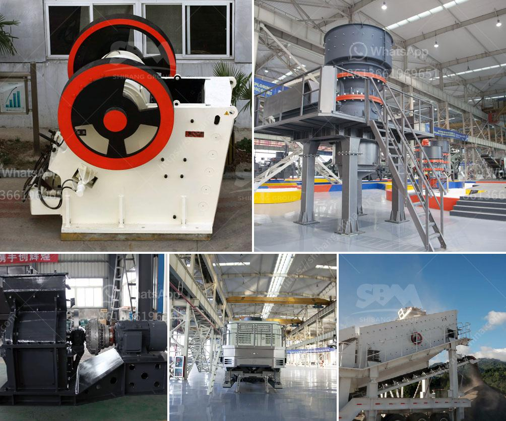

<h3>production line chrome ore concentration plant mar</h3>
The production line chrome ore concentration plant has been a significant contributor to the economic growth and development in many countries across the globe. This plant plays a crucial role in the mining industry by extracting valuable chrome ore from the ground and processing it to meet the stringent quality standards set by the market.

One of the primary objectives of a chrome ore concentration plant is to increase the concentration of chrome in the ore, making it suitable for various applications. The process starts with the excavation of chrome ore from open-pit or underground mines. The ore is then transported to the plant for further processing.

At the concentration plant, various techniques are utilized to separate the valuable chrome ore from unwanted impurities. The most commonly used method is gravity separation, where the heavy chrome particles sink to the bottom, while the lighter impurities rise to the top. This process is facilitated through the use of specialized equipment such as shaking tables, spirals, and jigs.

Once the chrome ore is separated, it goes through a series of physical and chemical processes to improve its quality and make it suitable for different applications. The ore is crushed, ground, and screened to obtain the desired size. It then undergoes further beneficiation processes such as magnetic separation, flotation, and leaching to eliminate remaining impurities and increase the chrome content.

The final product obtained from the chrome ore concentration plant is a valuable raw material extensively used in industries such as stainless steel production, alloy production, and chemical manufacturing. Chrome ore is also an essential component in the automotive industry for coating and corrosion resistance purposes.

In conclusion, the production line chrome ore concentration plant is a vital part of the mining industry, contributing to the extraction and processing of chrome ore. This plant's role in enhancing the quality of chrome ore and making it suitable for various applications cannot be undermined. It strengthens economic growth, creates employment opportunities, and serves as an indispensable link in the global supply chain.
<h3>Contact us</h3><ul><li><strong>Whatsapp:&nbsp;<a href="https://wa.me/8613661969651">+8613661969651</a></strong></li><li><a href="https://swt.shibang-china.com/?git&amp;zhl&amp;production line chrome ore concentration plant mar"><strong>Online Service(chat now)</strong></a></li></ul><h3>Related</h3><ul><li><a href='dolomite crusher manufacturing plant.md'>dolomite crusher manufacturing plant</a></li><li><a href='gold ore processing equipment manufacturer india.md'>gold ore processing equipment manufacturer india</a></li><li><a href='stone crushing equipment price in nigeria.md'>stone crushing equipment price in nigeria</a></li><li><a href='ball mill in zimbabwe for sale.md'>ball mill in zimbabwe for sale</a></li><li><a href='talcum powder philling machine.md'>talcum powder philling machine</a></li></ul>