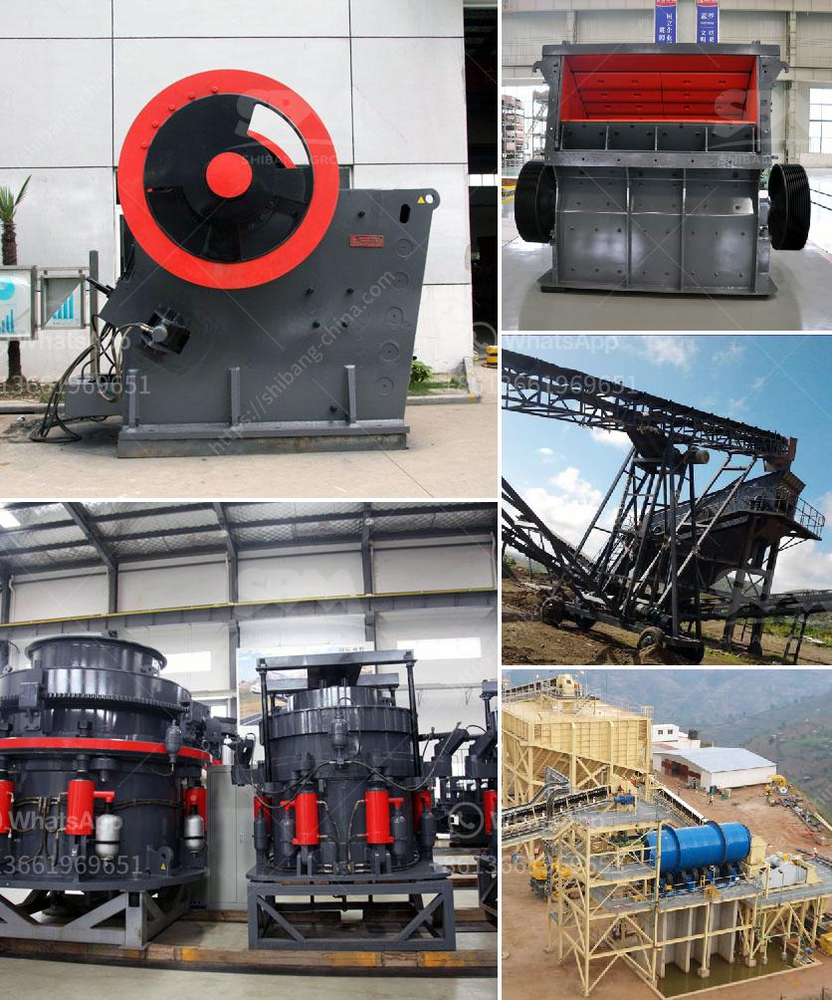

<h3>production of cement in guinee</h3>
The production of cement in Guinea is a thriving industry that plays a crucial role in the country's economic development. With a growing demand for infrastructure and construction projects, the cement industry in Guinea has witnessed significant growth in recent years.

Cement production in Guinea is primarily carried out by several major cement companies. These companies have established modern cement plants equipped with state-of-the-art technology and machinery. One of the leading cement companies in Guinea is Compagnie des Ciments de Guinée (CCG), which owns and operates a cement plant in the capital city of Conakry. CCG has been in operation for several decades and has established itself as a reliable and high-quality cement producer in the region.

The production process of cement in Guinea involves several stages. The process begins with the extraction of limestone, a primary raw material used in cement production. Limestone is mined from quarries and transported to the cement plant. Once at the plant, the limestone is crushed into smaller pieces and mixed with other materials, such as clay or shale, to create a fine powder known as raw meal.

The raw meal is then heated in a rotary kiln at high temperatures, typically around 1,450 degrees Celsius. This process, known as calcination, causes chemical reactions in the raw meal, resulting in the formation of clinker. The clinker is a nodular material that resembles small marbles and is the main component of cement.

After the clinker is cooled, it is mixed with gypsum and other additives, such as slag or fly ash, to produce different types of cement. These additives enhance the properties of the cement, such as setting time, strength, and durability. The final product is then ground into a fine powder, packaged, and ready for distribution to various construction sites.

The cement industry in Guinea plays a vital role in the country's infrastructure development. Cement is an essential building material used in the construction of roads, bridges, buildings, and infrastructure projects. The availability of high-quality cement produced locally reduces dependency on imports and supports the growth of the domestic construction sector.

Moreover, the production of cement in Guinea contributes to job creation and boosts the country's economy. Cement plants employ a significant number of workers across various stages of the production process, from mining to manufacturing and distribution. This creates employment opportunities and improves the living standards of individuals and communities.

However, the production of cement also poses environmental challenges. The extraction of limestone and the combustion of fossil fuels in cement kilns release greenhouse gases, contributing to climate change. The cement industry in Guinea, like many others, is investing in sustainable and environmentally friendly practices to mitigate these impacts. This includes the use of alternative fuels and raw materials, as well as energy-efficient technologies.

In conclusion, the production of cement in Guinea is a rapidly growing industry that supports the country's economy and infrastructure development. With modern cement plants and advanced production processes, Guinea produces high-quality cement to meet the growing demand for construction materials. As the industry continues to evolve, sustainability and environmental considerations will play an increasingly important role in shaping the future of cement production in Guinea.
<h3>Contact us</h3><ul><li><strong>Whatsapp:&nbsp;<a href="https://wa.me/8613661969651">+8613661969651</a></strong></li><li><a href="https://swt.shibang-china.com/?git&amp;zhl&amp;production of cement in guinee"><strong>Online Service(chat now)</strong></a></li></ul><h3>Related</h3><ul><li><a href='hp 300 cone crusher.md'>hp 300 cone crusher</a></li><li><a href='4 roller mill nigeria.md'>4 roller mill nigeria</a></li><li><a href='price of mobile stone crusher.md'>price of mobile stone crusher</a></li><li><a href='used raymond mill for sale.md'>used raymond mill for sale</a></li><li><a href='static jaw crusher for sale.md'>static jaw crusher for sale</a></li></ul>