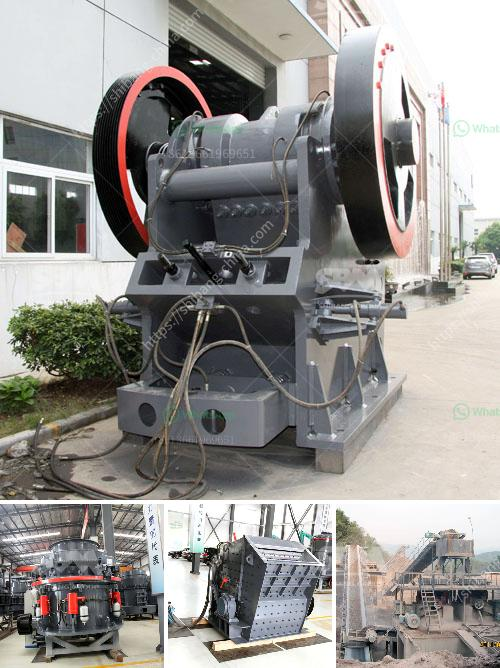

<h3>products lm vertical grinding mills</h3>
LM vertical grinding mills are advanced milling equipment, which are developed and launched by Zenith. It is suitable for a wide range of applications, including cement, coal, power plant desulfurization, metallurgy, chemical industry, non-metallic mineral industries. It can grind limestone, calcite, marble, kaolin, gypsum, barite, pyrophyllite, dolomite, and other non-metallic ores. With the advantages of low noise, high efficiency, energy-saving and high precision, LM vertical grinding mills are increasingly popular in the market.

One of the significant advantages of LM vertical grinding mills is its low noise level. Traditional mills generate a lot of noise during operation, which not only affects the working environment but also affects the mental health of workers. LM vertical grinding mills are equipped with a noise elimination device, which significantly reduces the noise during the operation. This makes it a perfect choice for workplaces that require a quiet environment.

Another advantage of LM vertical grinding mills is their high grinding efficiency. Compared with traditional mills, LM vertical grinding mills have a higher grinding efficiency. The grinding roller directly grinds the material on the grinding disc, which can save energy by 30% to 40% compared with the ball mill system. Furthermore, the grinding roller can be lifted and lowered automatically, which significantly reduces labor intensity and improves work efficiency.

Energy-saving is another outstanding feature of LM vertical grinding mills. The motor of LM vertical grinding mills is equipped with a high-efficiency reducer, which can reduce the power consumption of the motor by more than 35%. In addition, the roller and grinding disc are made of high-quality materials, which have good wear resistance and can prolong the service life of the equipment. This not only saves energy but also reduces the maintenance cost of the equipment.

The precision of LM vertical grinding mills is also remarkable. The grinding roller and grinding disc are precision-cast and have undergone strict balance tests, which ensures the stability and precision of the equipment during operation. The grinding size can be adjusted within a wide range, which not only satisfies the requirements of various industries but also improves the fineness and output of the finished product.

In conclusion, LM vertical grinding mills are an excellent choice for various industries that require high-efficiency, energy-saving, low-noise, and high-precision milling equipment. With its advanced technology and outstanding performance, LM vertical grinding mills have gained a good reputation in the market. Whether it is cement, coal, power plant desulfurization, metallurgy, chemical industry, or non-metallic mineral industries, LM vertical grinding mills can provide efficient and reliable milling solutions.
<h3>Contact us</h3><ul><li><strong>Whatsapp:&nbsp;<a href="https://wa.me/8613661969651">+8613661969651</a></strong></li><li><a href="https://swt.shibang-china.com/?git&amp;zhl&amp;products lm vertical grinding mills"><strong>Online Service(chat now)</strong></a></li></ul><h3>Related</h3><ul><li><a href='mining equipment used during gold rush.md'>mining equipment used during gold rush</a></li><li><a href='crusher machine for sale in ethiopia.md'>crusher machine for sale in ethiopia</a></li><li><a href='the process of limestone.md'>the process of limestone</a></li><li><a href='used rock crusher europe.md'>used rock crusher europe</a></li><li><a href='vail crushing meachine models in pharma.md'>vail crushing meachine models in pharma</a></li></ul>