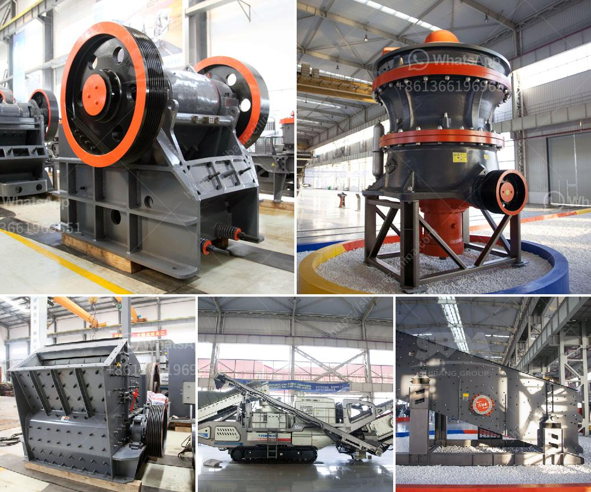

<h3>professional granite cone crusher</h3>
Granite cone crusher is one of the most sought after machinery that facilitates the effective crushing of hard materials. Presently, there are numerous models and specifications of the cone crusher. With the growing demand for materials such as granite, the cone crusher market is expected to witness a surge in demand.

One of the key reasons why the cone crusher is preferred by professionals in the industry is because of its ability to provide precise, efficient, and consistent crushing results. The cone crusher offers the advantage of low operation costs, high productivity, easy adjustment, and stable structure. These features make it the perfect solution for the crushing requirements of granites.

The cone crusher is equipped with a hydraulic system that enables the users to easily adjust the size of the product, and thereby regulate the size of the feed opening. This feature ensures that the final product is of optimal size, which in turn leads to improved performance and efficiency. Furthermore, the hydraulic system also protects the cone crusher from damage caused by overloading or other operational errors.

Another advantage of the cone crusher in granite crushing is its ability to crush materials with a variety of hardness levels. Granites usually vary in hardness, and the cone crusher’s ability to crush such materials without any difficulty makes it the perfect choice for the granite crushing industry.

In addition to this, the cone crusher is designed with a robust structure and uses high-quality materials. This ensures that it can withstand the rigorous demands of the granite crushing process. The cone crusher also incorporates advanced technology to enhance its performance and ensure smooth and efficient operation.

The cone crusher is also equipped with a control system that provides a higher level of automation. This enables the operator to monitor and control the entire crushing process, thereby minimizing human error and improving overall efficiency. The control system also facilitates remote monitoring and enables quick troubleshooting in case of any issues.

Furthermore, the cone crusher is designed for easy maintenance, which contributes to its longevity and reliable performance. The access to all the key components is hassle-free, making it easier for maintenance personnel to carry out routine inspections and repairs. This helps to minimize downtime and maximize productivity.

In conclusion, the granite cone crusher has revolutionized the stone crushing industry, providing the perfect solution for crushing and processing hard materials. With its precision and efficiency, the cone crusher offers multiple benefits to professionals in the granite industry. Its ability to adjust the size of the final product, crush materials of various hardness levels, and incorporate advanced technology and automation make it a game-changer in the stone crushing industry. Moreover, its robust structure and ease of maintenance ensure its longevity and reliable performance. With growing demand for materials such as granite, the cone crusher is set to thrive in the coming years as a crucial component in the stone crushing process.
<h3>Contact us</h3><ul><li><strong>Whatsapp:&nbsp;<a href="https://wa.me/8613661969651">+8613661969651</a></strong></li><li><a href="https://swt.shibang-china.com/?git&amp;zhl&amp;professional granite cone crusher"><strong>Online Service(chat now)</strong></a></li></ul><h3>Related</h3><ul><li><a href='feldspar powder machine.md'>feldspar powder machine</a></li><li><a href='ball mill cement plant.md'>ball mill cement plant</a></li><li><a href='portable cone crusher.md'>portable cone crusher</a></li><li><a href='jaw crusher for sale philippines.md'>jaw crusher for sale philippines</a></li><li><a href='cone crusher for sale.md'>cone crusher for sale</a></li></ul>