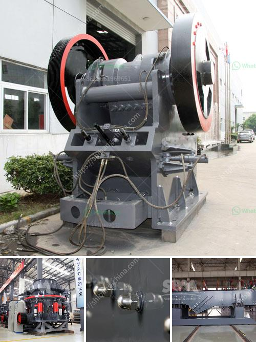

<h3>profitable cement plant for sale in tamilnadu</h3>
Tamil Nadu, a thriving state located in the southern part of India, has a highly developed industrial sector. Known for its robust infrastructure, stable policies, and thriving construction industry, the state offers an ideal environment for businesses seeking profitable ventures. One such opportunity lies in the acquisition of a cement plant for sale in Tamil Nadu, a state that consistently experiences rising demand for cement due to its rapid urbanization and infrastructure development.

Tamil Nadu's construction sector has been witnessing unprecedented growth in recent years. The state government's focus on infrastructure development, including the construction of highways, bridges, and industrial corridors, has resulted in a consistent demand for cement. Additionally, the increasing population and rising urbanization have led to a surge in the construction of residential and commercial buildings, further fueling the need for cement.

Acquiring a cement plant in Tamil Nadu offers significant advantages due to the state's strategic location. Tamil Nadu serves as a gateway to South India, which accounts for a significant share of India's cement consumption. With its well-connected transport network, including an extensive road and rail system, the state enables effortless distribution of cement not only within Tamil Nadu but also to neighboring states like Kerala, Karnataka, Andhra Pradesh, and Telangana.

Tamil Nadu has long been acclaimed for its business-friendly policies. The state government's commitment to creating a conducive investment climate has attracted numerous industries, including cement manufacturing. Investors are provided with various incentives, such as tax benefits, subsidies, and concessional land rates, ensuring a favorable operational environment for cement plant owners.

Another advantage of acquiring a cement plant in Tamil Nadu is the availability of a skilled workforce. The state has a well-educated and professional labor pool, which is crucial for ensuring efficient operations, maintaining quality standards, and exploring opportunities for innovation and improvement. This advantage significantly reduces the cost and effort associated with training employees, ultimately contributing to the profitability of the cement plant.

Tamil Nadu’s strong market potential makes it an attractive destination for cement plant buyers. The state's growing economy, coupled with a rising middle-class population, ensures a consistent demand for cement in the foreseeable future. The government's focus on affordable housing schemes and initiatives to promote private investment further augments the demand for cement, providing ample growth opportunities for cement plant owners.

The cement industry in Tamil Nadu is poised for tremendous growth, thanks to the state's robust infrastructure development, rising construction activities, and favorable policies. Acquiring a cement plant in Tamil Nadu presents a lucrative opportunity for investors seeking a profitable venture. With the state experiencing a consistent demand for cement, its strategic location, stable policy environment, presence of a skilled workforce, and strong market potential make it an ideal destination for cement plant buyers. Embracing this opportunity can pave the way for long-term success and growth in the cement industry.
<h3>Contact us</h3><ul><li><strong>Whatsapp:&nbsp;<a href="https://wa.me/8613661969651">+8613661969651</a></strong></li><li><a href="https://swt.shibang-china.com/?git&amp;zhl&amp;profitable cement plant for sale in tamilnadu"><strong>Online Service(chat now)</strong></a></li></ul><h3>Related</h3><ul><li><a href='mobile gold processing plant.md'>mobile gold processing plant</a></li><li><a href='quarry crusher equipment for sale.md'>quarry crusher equipment for sale</a></li><li><a href='quartz stone production line machinery.md'>quartz stone production line machinery</a></li><li><a href='pakistan directory of cement plants list pdf.md'>pakistan directory of cement plants list pdf</a></li><li><a href='portable limestone jaw crusher for hire in south africa.md'>portable limestone jaw crusher for hire in south africa</a></li></ul>