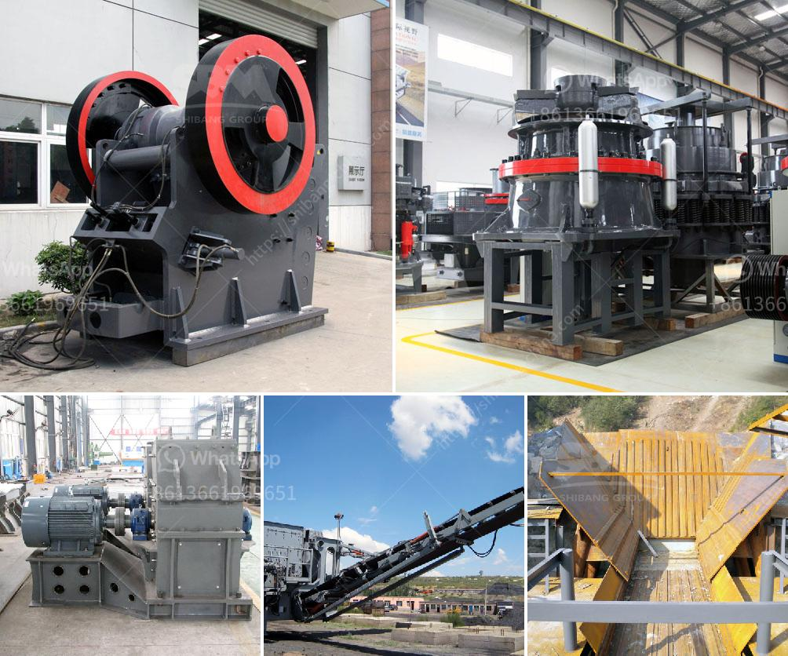

<h3>project feasibility report on stone crusher</h3>
Stone crushing industry is an important industrial sector in the country engaged in producing crushed stone of various sizes depending upon the requirement which acts as raw material for various construction activities such as construction of roads, highways, bridges, buildings, canals etc.

It is estimated that there are over 15,000 stone crusher units in India. The number is expected to grow further keeping in view the future plans for development of infrastructure of roads, canals and buildings that are required for overall development of the country. In India, the Stone Crushing Industry sector is estimated to have an annual turnover of Rs. 5000 crore (equivalent to over US$ 1 billion) and is therefore an economically important sector.

The sector is estimated to be providing direct employment to over 500,000 people engaged in various activities such as mining, crushing plant, transportation of mined stones and crushed products etc. Most of these personnel are from rural and economically backward areas where employment opportunities are limited and therefore it carries greater significance in terms of social importance in rural areas. It is a source of earning for uneducated poor unskilled rural people.

Stone crushers are small scale industries in the unorganised sector. They provide basic material for road and building construction. They are highly labour intensive. The various unit operations involved in stone crushing viz., size reduction, size classification and transfer operations have the potential to emit process and fugitive dust.

A detailed study was conducted to evaluate the air quality in stone crushing units. It was found that the concentration of suspended particulate matter (SPM) varied from 716 to 916 μg/m3 with respect to locations and sources of emission. It is observed that the average ambient air quality of two locations in comparison to the control site was not found to be significantly polluted since it is below the permissible limits of 500 μg/m3.

A feasibility study is being prepared by experts from the industry and the findings will be incorporated into the final project feasibility report. The objective of the feasibility study is to evaluate the quality of stone products mined from the proposed project and determine its economic viability.

The report will assess the crushing process, operation, environmental impacts, and cost analysis of the proposed project. The findings from the study will provide guidance on whether the project can be successfully implemented and if it will yield positive economic benefits.

Additionally, the feasibility study will assess the availability of raw material, labor requirements, machinery requirements, energy consumption, and other factors that may affect the project. It will also consider the potential environmental impacts of the project and propose appropriate mitigation measures.

The stone crusher industry plays an important role in the economy and development of countries. The estimated revenue generation from the industry in India is around Rs. 5,000 crore, contributing to GDP growth, employment opportunities, and infrastructure development.

Overall, the feasibility study on the stone crusher project will be a comprehensive assessment of the practicality of the proposed project, considering all aspects, including market demand, technical requirements, financial viability, and environmental impact. The findings from the study will ultimately determine the feasibility and success of the project, guiding decision-makers and stakeholders towards informed and responsible choices.
<h3>Contact us</h3><ul><li><strong>Whatsapp:&nbsp;<a href="https://wa.me/8613661969651">+8613661969651</a></strong></li><li><a href="https://swt.shibang-china.com/?git&amp;zhl&amp;project feasibility report on stone crusher"><strong>Online Service(chat now)</strong></a></li></ul><h3>Related</h3><ul><li><a href='impact crusher in egypt.md'>impact crusher in egypt</a></li><li><a href='renting of screens and crushers in middelburg.md'>renting of screens and crushers in middelburg</a></li><li><a href='cost of grizzly crusher.md'>cost of grizzly crusher</a></li><li><a href='mobile crusher unit.md'>mobile crusher unit</a></li><li><a href='silica sand concrete in ethiopia.md'>silica sand concrete in ethiopia</a></li></ul>