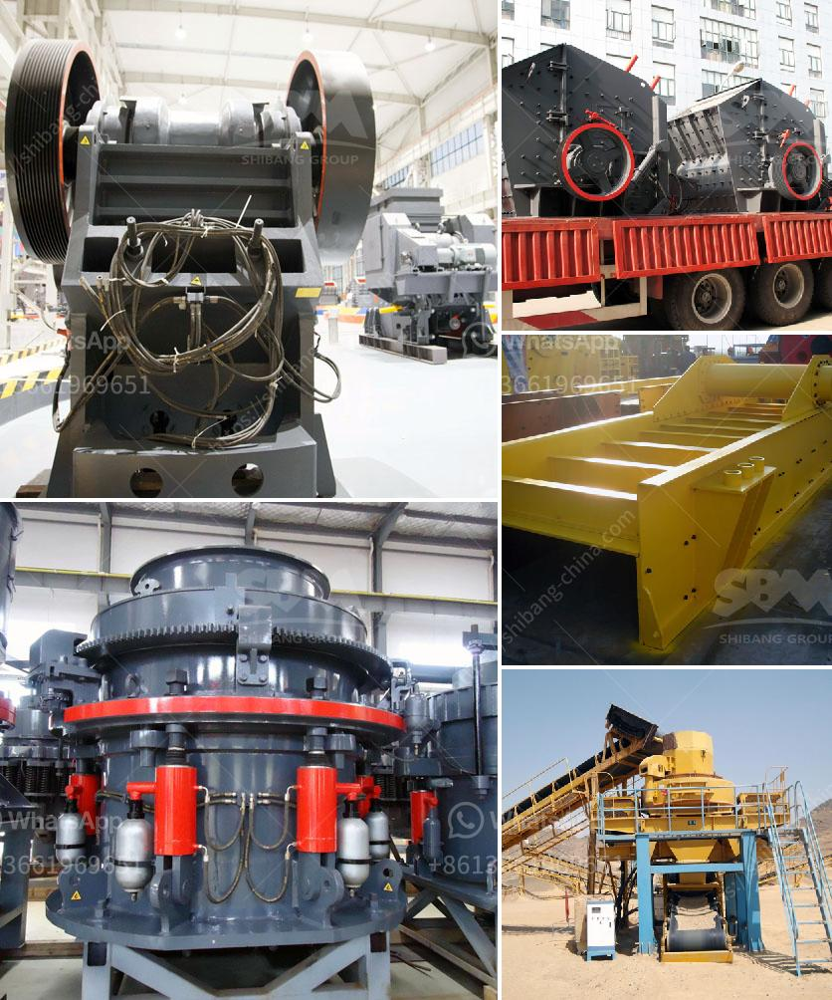

<h3>project report of grinding mill</h3>
Grinding mill is a large-scale mechanical equipment used to grind various types of materials into fine powder. In the past, these machines were primarily used in the construction and mining industries, but over time they have found use in many other industries.

Grinding mills come in a variety of sizes, ensuring that there is a suitable machine for every application. Smaller mills can be used for grinding grain or other similar materials, while larger mills are capable of handling heavier, more demanding tasks. They are commonly used to grind materials such as cement clinker, limestone, coal, and ore.

The main purpose of a grinding mill is to reduce the size of a material. This is achieved by bringing the material into contact with a rotating drum, which contains grinding media. The media can be made up of various materials, such as steel balls, ceramic balls, or rods, depending on the type of mill and the material being ground. As the drum rotates, the grinding media crushes and grinds the material, resulting in the desired particle size.

A grinding mill is typically powered by electricity, although some models may be powered by a diesel engine or gas turbine. The power consumption of a mill depends on its size, the material being ground, and the desired fineness. It is important to consider energy efficiency when selecting a grinding mill to minimize operating costs.

The construction of a grinding mill involves several stages. First, the raw material is crushed into smaller pieces by a crusher, which is typically a jaw crusher or impact crusher. Then, the crushed material is fed into a hopper, from where it is transferred to the grinding chamber. Inside the grinding chamber, the material is subjected to continuous grinding and crushing until it reaches the desired particle size.

The finished product is collected in a dust collection system, which prevents the fine powder from escaping into the surrounding environment. This is particularly important in industries where the dust may be hazardous or pose a health risk. It is essential to properly maintain and clean the dust collection system to ensure its efficient operation.

Grinding mills are widely used in various industries, including cement, mining, metallurgy, chemical, and power generation. They play a crucial role in improving productivity and efficiency by reducing the size of materials and creating a more homogeneous product.

In conclusion, a grinding mill is a powerful and versatile equipment used to grind various types of materials into fine powder. It is a crucial component of many industrial processes and requires careful selection and maintenance. With advances in technology, grinding mills continue to evolve, offering enhanced performance and energy efficiency.
<h3>Contact us</h3><ul><li><strong>Whatsapp:&nbsp;<a href="https://wa.me/8613661969651">+8613661969651</a></strong></li><li><a href="https://swt.shibang-china.com/?git&amp;zhl&amp;project report of grinding mill"><strong>Online Service(chat now)</strong></a></li></ul><h3>Related</h3><ul><li><a href='pulverizer crusher manufacturer in chennai.md'>pulverizer crusher manufacturer in chennai</a></li><li><a href='jaw crusher 600x900 indonesia.md'>jaw crusher 600x900 indonesia</a></li><li><a href='about aggregate crusher plants.md'>about aggregate crusher plants</a></li><li><a href='roller crusher for coal.md'>roller crusher for coal</a></li><li><a href='iron jaw crusher with output of mm.md'>iron jaw crusher with output of mm</a></li></ul>