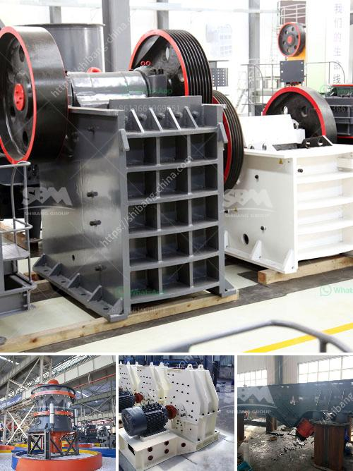

<h3>propel mobile crusher</h3>
The Propel Mobile Crusher is a compact and versatile machine that combines true mobility with high crushing capacity. Designed to deliver maximum productivity and efficiency, the Propel Mobile Crusher is a perfect choice for a wide range of applications.

With its robust construction and state-of-the-art technology, the Propel Mobile Crusher is engineered to exceed the expectations of customers in the mining, quarrying, and recycling industries. The machine is equipped with a powerful jaw crusher that can crush a variety of materials with ease.

One of the key features of the Propel Mobile Crusher is its high capacity. The machine can handle large volumes of material, making it ideal for primary and secondary crushing applications. Whether you need to crush hard rock or recycle construction and demolition waste, the Propel Mobile Crusher can get the job done efficiently.

In addition to its high capacity, the Propel Mobile Crusher also offers excellent fuel efficiency. The machine is equipped with an advanced engine that delivers optimal performance while minimizing fuel consumption. This not only helps reduce operating costs but also makes the machine more environmentally friendly.

Another notable feature of the Propel Mobile Crusher is its easy operation. The machine is designed to be user-friendly, with a simple and intuitive interface that allows operators to quickly and easily control the machine. Whether you're a skilled operator or new to crushing operations, the Propel Mobile Crusher makes it easy to get started and achieve consistent results.

Durability is also a focus of the Propel Mobile Crusher's design. The machine is built to withstand the toughest conditions, whether it's extreme heat, cold, or vibration. This ensures that the machine will continue to perform reliably in even the harshest environments, reducing downtime and increasing productivity.

The versatility of the Propel Mobile Crusher is another standout feature. The machine is equipped with a range of optional attachments and features that enable it to adapt to different applications. From screening and scalping to stockpiling and material handling, the Propel Mobile Crusher can be customized to meet your specific needs.

The compact size of the Propel Mobile Crusher is another advantage. The machine is designed to be easily transportable, making it ideal for on-site crushing operations. This eliminates the need for costly transportation and reduces the overall project time, saving your company time and money.

In conclusion, the Propel Mobile Crusher is a high-capacity, fuel-efficient, and user-friendly machine that is perfect for a wide range of crushing applications. Whether you need to crush hard rock or recycle construction waste, this machine delivers exceptional performance and productivity. With its durable construction and versatile features, the Propel Mobile Crusher is a valuable asset for any job site.
<h3>Contact us</h3><ul><li><strong>Whatsapp:&nbsp;<a href="https://wa.me/8613661969651">+8613661969651</a></strong></li><li><a href="https://swt.shibang-china.com/?git&amp;zhl&amp;propel mobile crusher"><strong>Online Service(chat now)</strong></a></li></ul><h3>Related</h3><ul><li><a href='1 tonne roller mill.md'>1 tonne roller mill</a></li><li><a href='roller mill for onions.md'>roller mill for onions</a></li><li><a href='china jaw crusher pe 150 250 in philippines.md'>china jaw crusher pe 150 250 in philippines</a></li><li><a href='cost of mobile stone crusher.md'>cost of mobile stone crusher</a></li><li><a href='kaolin processing crusher uganda.md'>kaolin processing crusher uganda</a></li></ul>