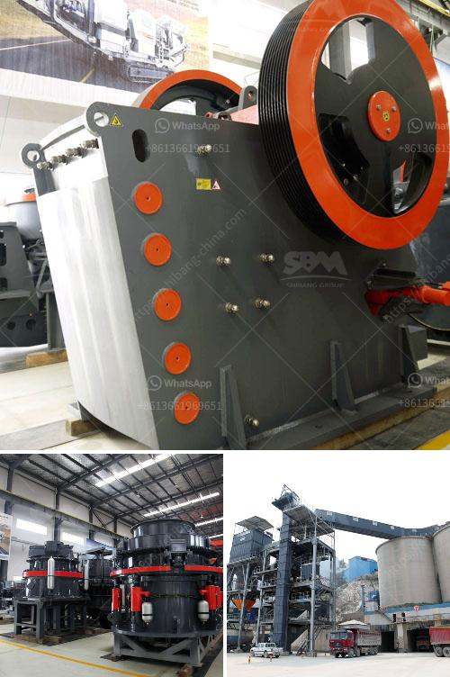

<h3>pulverizer crusher manufacturer in chennai</h3>
The demand for pulverizer crushers is on the rise in many industries such as mining, construction, and manufacturing. In response to this increasing demand, several manufacturers in Chennai are coming up with high-quality pulverizer crushers to meet the diverse needs of their clients.

A pulverizer crusher plays a crucial role in various industries, as it helps in reducing the size of different types of materials. It effectively crushes materials and transforms them into smaller particles, making them easier to handle or process. These crushers are used widely in mining operations to break down large rocks into smaller, more manageable sizes. They are also used in the construction industry to crush and recycle concrete waste materials.

When it comes to choosing a pulverizer crusher manufacturer in Chennai, it is important to consider several factors. One of the essential factors to look for is the manufacturer's reputation. A reputable manufacturer will have a track record of producing high-quality crushers that are reliable, efficient, and durable. They will also have positive customer reviews and testimonials, which reflect their commitment to customer satisfaction.

Another crucial factor to consider is the manufacturer's experience and expertise in the field. An experienced manufacturer will have a deep understanding of the requirements and challenges faced by different industries. They will develop crushers that are specifically designed to handle the unique demands of each industry.

A reliable manufacturer will also provide excellent after-sales service and technical support. This ensures that any issues or concerns faced by clients are promptly addressed, allowing for smooth operations and minimal downtime. They will also offer comprehensive warranty coverage, which provides peace of mind to clients.

In conclusion, the presence of a reputable pulverizer crusher manufacturer in Chennai is a boon for industries in need of efficient and high-quality crushers. By choosing the right manufacturer, businesses can ensure that they have access to reliable and durable crushers that meet their specific requirements.
<h3>Contact us</h3><ul><li><strong>Whatsapp:&nbsp;<a href="https://wa.me/8613661969651">+8613661969651</a></strong></li><li><a href="https://swt.shibang-china.com/?git&amp;zhl&amp;pulverizer crusher manufacturer in chennai"><strong>Online Service(chat now)</strong></a></li></ul><h3>Related</h3><ul><li><a href='mill for gold mining operation.md'>mill for gold mining operation</a></li><li><a href='vsi crusher manufacturers.md'>vsi crusher manufacturers</a></li><li><a href='barite production process.md'>barite production process</a></li><li><a href='used clay powder drying machinery.md'>used clay powder drying machinery</a></li><li><a href='china gold dry washer manufacturer in philippines.md'>china gold dry washer manufacturer in philippines</a></li></ul>