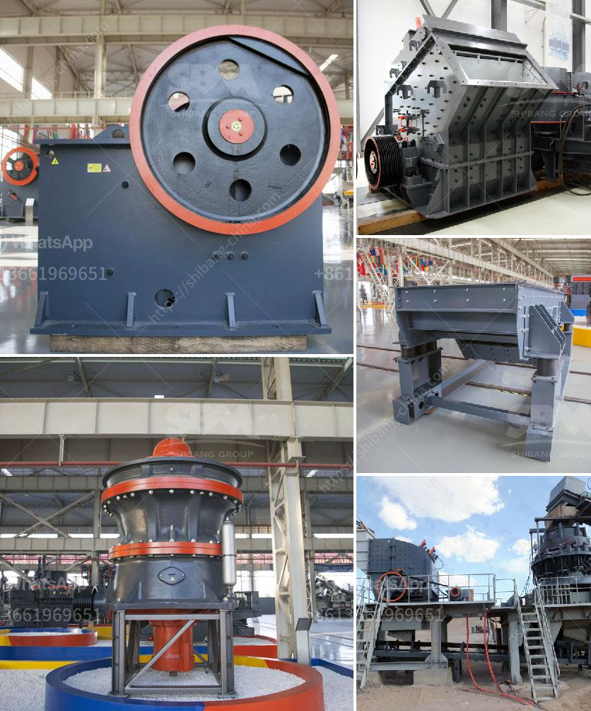

<h3>purchase of cement crusher machines</h3>
When it comes to cement production, a sturdy and reliable cement crusher machine is required. A vast variety of the cement manufacturing plants nowadays utilize the cement crusher machines in order to reduce the size of rocks, separate them efficiently, and crush them into smaller pieces. This is achieved by using powerful equipment known as crushers.

Cement crushers are essential and widely used in the cement production process, as the limestone is the main raw material for manufacturing cement. These machines are highly efficient and durable, and they are designed to tackle the toughest of materials. The desired end result is a fine powder of high-quality raw materials, increased production efficiency, reduced energy consumption, and improved overall safety.

Purchasing cement crusher machines requires a comprehensive understanding of local regulations, engineering standards, and challenges encountered in the field. In order to ensure a successful purchase, it is essential to gather all the information regarding the product and its specifications, allowing you to make an informed decision.

First and foremost, it is crucial to examine the material that will be handled by the crusher. Different crushers are designed to handle different types of materials, so the selection of the appropriate crusher is critical for the success of cement production. If the raw material is too hard, a larger sized crusher will be required, while softer materials can be handled with smaller crushers.

Additionally, when purchasing a crusher machine, it is important to consider the particle size requirements of the output material. Not all crushers are capable of producing particles of the desired size. Therefore, determining the required output size before making a purchase decision is vital, as it impacts the overall efficiency and output of the cement production process.

Furthermore, it is crucial to assess the overall capacity and power of the crusher machine. Cement crushers are typically designed to handle a few hundred tons per hour but many plants require crushers that can handle well over 1,000 tons. Purchasing the wrong crusher can be financially disastrous, so it's essential to know the capacity a particular machine needs to handle before making a purchase.

Moreover, the operational costs of the crusher machine should also be considered. Electricity consumption, wear and tear of the machine parts, and maintenance costs are crucial factors to take into account. Choosing a crusher machine with low operational costs can significantly reduce the overall cost of cement production.

Last but not least, it is important to find a reputable supplier that provides high-quality and reliable cement crusher machines. The durability of the equipment, its spare parts, and the aftersales support should not be overlooked. Investing in a crusher machine that is backed by excellent customer service and technical support will ensure peace of mind and maximize the return on investment.

In conclusion, purchasing cement crusher machines requires thorough research, meticulous planning, and a comprehensive understanding of your plant's specifications. It is essential to choose a reliable supplier that offers high-quality machines at a reasonable price. By considering factors such as material handling, required output size, capacity, operational costs, and supplier reputation, you can make an informed decision and ensure a successful purchase of cement crusher machines.
<h3>Contact us</h3><ul><li><strong>Whatsapp:&nbsp;<a href="https://wa.me/8613661969651">+8613661969651</a></strong></li><li><a href="https://swt.shibang-china.com/?git&amp;zhl&amp;purchase of cement crusher machines"><strong>Online Service(chat now)</strong></a></li></ul><h3>Related</h3><ul><li><a href='magnetic enrichment of manganese ore.md'>magnetic enrichment of manganese ore</a></li><li><a href='barite ore processing equipment rent and sale.md'>barite ore processing equipment rent and sale</a></li><li><a href='price of copper ore crushing machine.md'>price of copper ore crushing machine</a></li><li><a href='crusher manufacturers in saudi.md'>crusher manufacturers in saudi</a></li><li><a href='granite quarry companies in europe.md'>granite quarry companies in europe</a></li></ul>